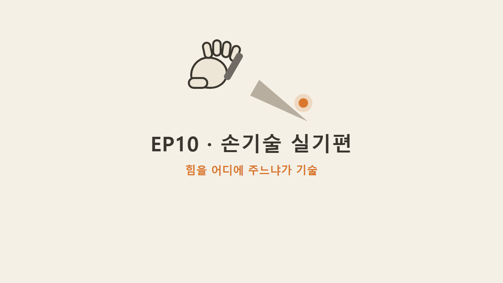
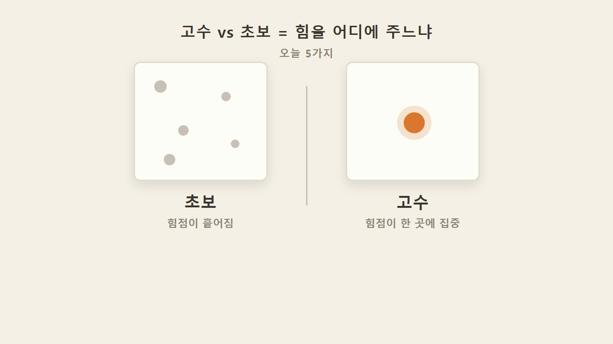
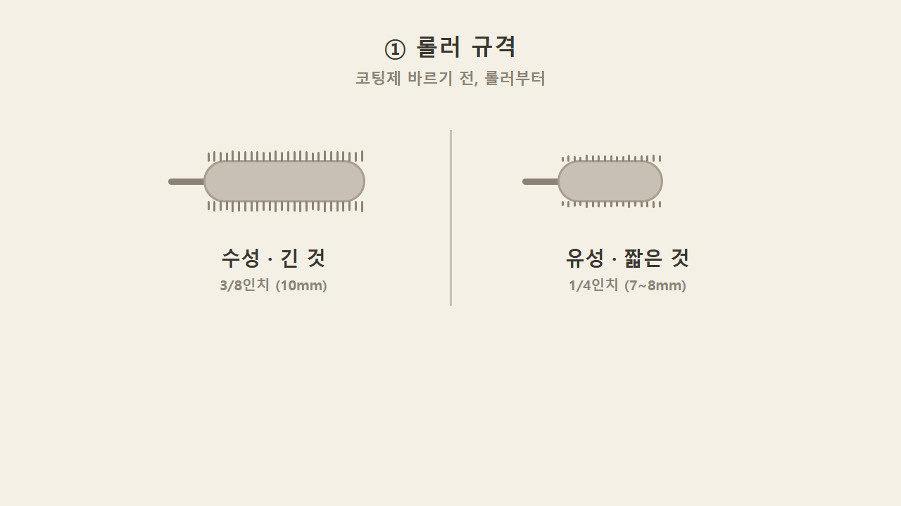
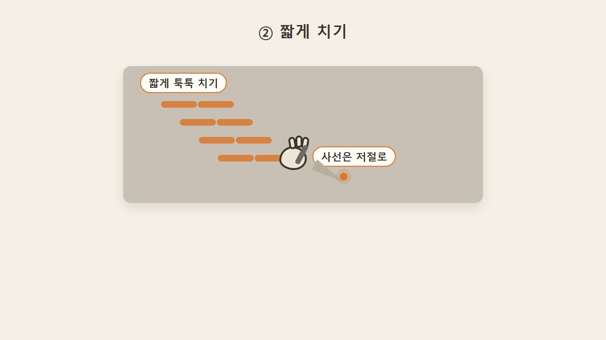
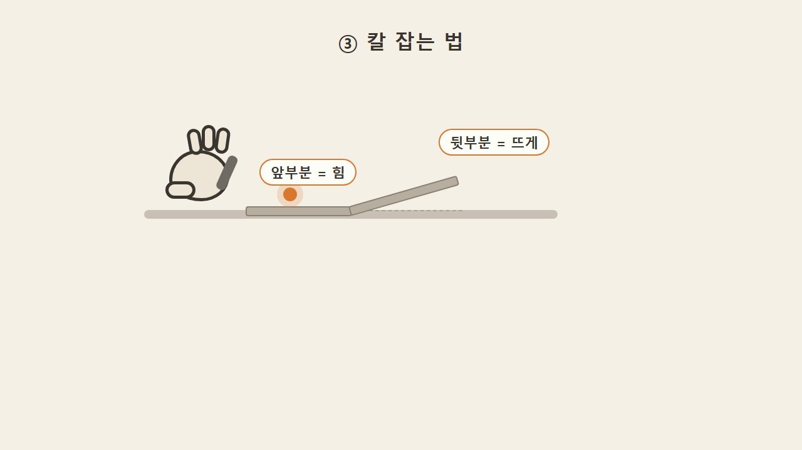
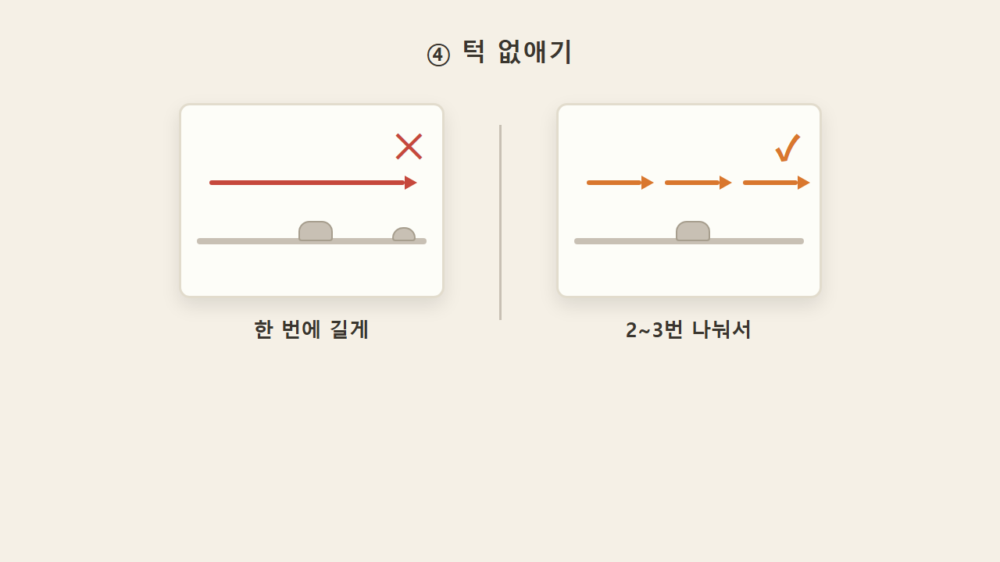
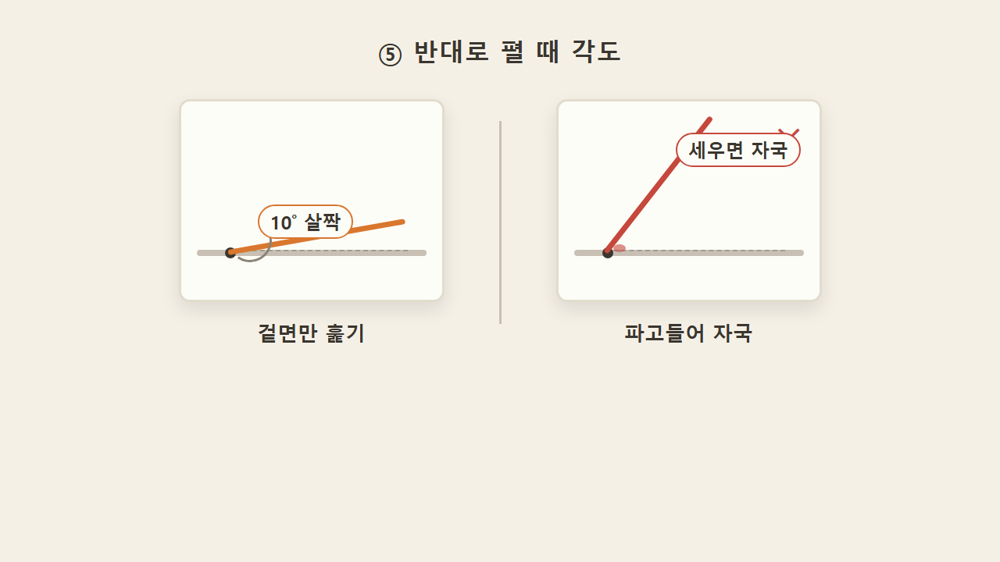
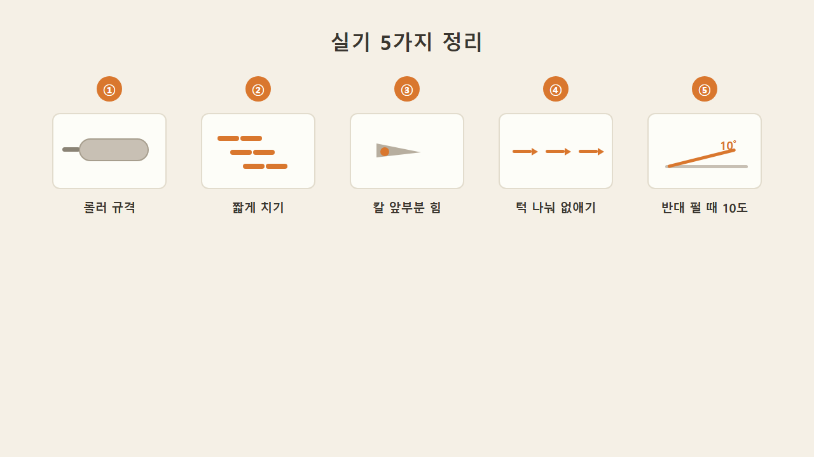
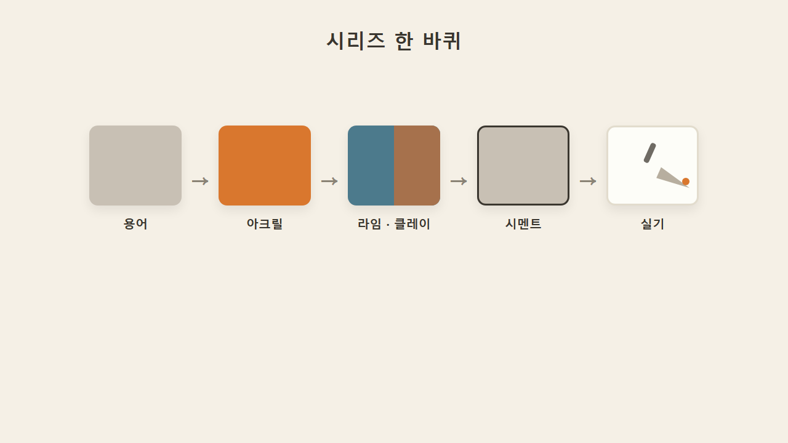

# EP10 — 손기술 실기

> 영상 EP10의 학습용 텍스트판. 화면·순서가 영상과 1:1. 원문 출처: [00_원문소스.md](00_원문소스.md)

## 1. 마지막 편, 손기술 실기

드디어 마지막 편이다. 오늘은 이론 없이 순수하게 손기술이다.

## 2. 고수와 초보 차이 — 힘을 어디에 주느냐

고수와 초보를 가르는 건 경력이 아니라 힘을 어디에 주느냐다. 오늘 다룰 다섯 가지가 전부 이 얘기다. 시작하기 전에 코팅제 바를 때 쓰는 롤러부터 짚는다.

## 3. ① 롤러 규격 — 수성은 긴 것, 유성은 짧은 것

수성 코팅제엔 긴 롤러(3/8인치, 10mm), 유성엔 짧은 롤러(1/4인치, 7~8mm)를 쓴다. 이는 도장 일반 관행과도 맞닿아 있는 기준이다.

## 4. ② 짧게 치기 — 사선은 저절로 만들어진다

칼로 바를 때는 짧게 친다. 사선으로 가야 한다고 억지로 각도를 맞추려 할 필요는 없다. 여럿이서 순서대로 짧게 치고 나가면 저절로 사선으로 이어진다 — 억지로 만드는 게 아니라 짧게 치는 걸 반복하면 알아서 그렇게 나오는 결과다.

## 5. ③ 칼 앞부분만 힘, 뒷부분은 뜨게

칼 앞부분만 잡고 그 부분에만 힘을 준다. 뒷부분은 힘을 빼고 자연스럽게 뜨게 놔둔다. 앞에만 힘을 모아야 미는 힘이 정교하게 조절되고, 뒤까지 눌러버리면 힘이 분산돼 반죽이 거칠게 밀린다.

## 6. ④ 턱 없애기 — 2~3번 나눠서

턱을 없앨 땐 길게 한 번에 쭉 빼면 안 된다. 2~3번으로 나눠서 조금씩 빼줘야 한다. 한 번에 길게 빼면 반죽이 끌려가면서 다른 자리에 새 턱이 생기거나 얇아지는 자리가 생긴다.

## 7. ⑤ 반대로 펼 땐 각도 10도만

반대로 펴 줄 때는 각도가 핵심이다. 칼을 확 세우면 안 되고 10도 정도만 살짝 들어서 편다. 각도를 세게 주면 칼끝이 파고 들어가 자국이 남고, 10도만 살짝 들면 겉면만 훑고 지나가 매끈하게 펴진다.

## 8. 실기 다섯 가지 요약

롤러 규격, 짧게 치기, 칼 앞부분 힘주기, 턱은 나눠서 없애기, 반대로 펼 때 10도. 오늘 실기의 전부다.

## 9. 시리즈 한 바퀴 — 용어부터 손기술까지

EP6에서 레진(재료 성분)과 바인더(결합 기능)부터 시작해, 바름재를 성분으로 나누면 아크릴·라임·시멘트·클레이 네 가지라는 걸 정리했다. EP7에서는 아크릴 — 유연하고 접착력 좋아 기존 도장면 위에도 시공 가능하고, 파렉스 알토·티에라는 무광, 브리오는 유광에 대리석 느낌이었다. EP8에서는 라임과 클레이 — 라임은 강알칼리라 곰팡이가 못 살고 문지를수록 광이 나지만 컬러는 파스텔까지만 가능했고, 클레이는 흙이라 습도조절은 좋지만 내구성 때문에 국내에서는 잘 쓰이지 않았다. EP9에서는 시멘트 — 성분 중 내구성이 제일 강했고, 브리오·타데락트 같은 유광 마감은 물에 약해 욕실엔 못 쓰며, 결국 내부용·외부용을 가르는 기준도 물에 강하냐 약하냐 하나였다. 그리고 오늘 실기까지, 이론과 손기술이 한 바퀴로 이어졌다.

### 한 줄 정리

> 힘을 어디에 주느냐가 기술이다 — 짧게 치고, 칼 앞부분만 힘주고, 턱은 나눠서 없애고, 반대로 펼 땐 10도만.

### 셀프 체크

**Q1.** 턱을 없앨 때 한 번에 길게 빼는 게 맞을까, 나눠서 빼는 게 맞을까?
**A.** 나눠서 — 2~3번 나눠서 뺀다.

**Q2.** 반대로 펴 줄 때 칼 각도는?
**A.** 10도.

**Q3.** 곰팡이가 절대 못 사는 이유는 라임의 어떤 성질 때문이었나?
**A.** 강알칼리성.

**Q4.** 내부용·외부용을 가르는 기준 하나는?
**A.** 물에 강하냐 약하냐.
