# EP1 — EPS 완전정복

> 영상 EP1의 학습용 텍스트판. 화면·순서가 영상과 1:1. 원문 출처: [00_원문소스.md](00_원문소스.md)

## 1. 외단열, 그리고 오늘 배울 EPS

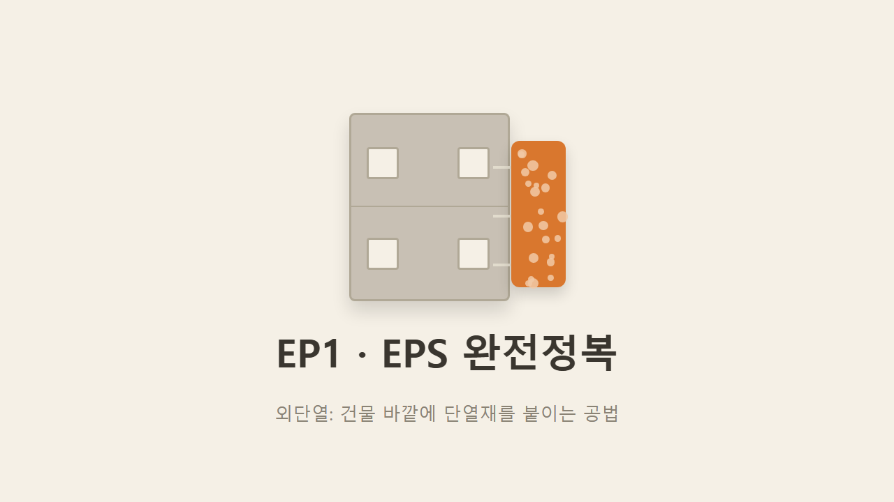

외단열은 건물 바깥쪽에 단열재를 붙이고 그 위를 마감하는 공법이다. 현장에서 가장 먼저, 가장 많이 다루는 자재가 이 단열재 판인데, 그중에서도 가장 기본이자 가장 흔한 재료가 EPS다. 이번 시리즈는 EPS를 시작으로 다른 단열재 소재, 등급 체계, 지역별 두께, 그 위에 덮는 메쉬까지 이어서 다룬다.

## 2. 택배 스티로폼과 외단열 단열재는 같은 재료

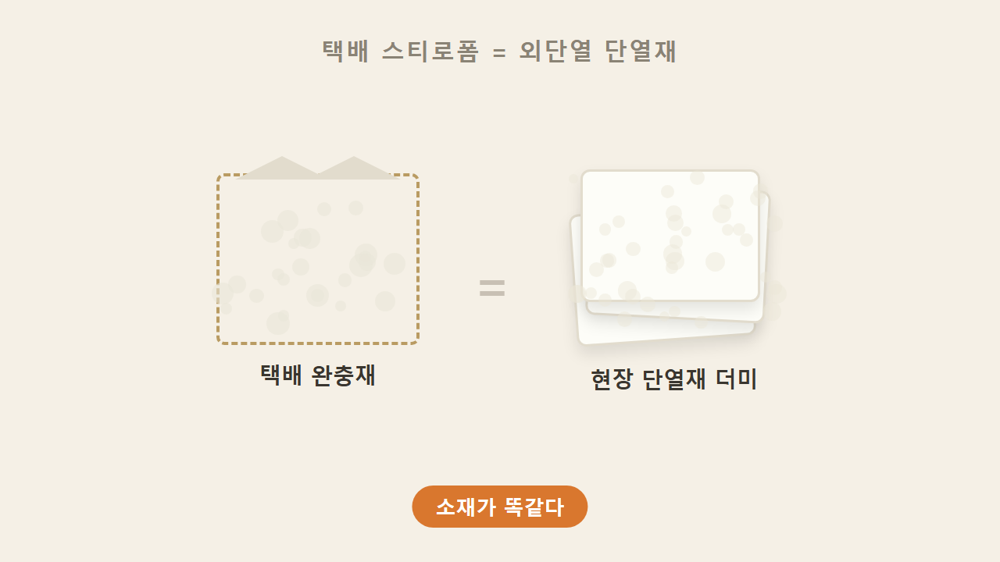

택배 상자 안에 든 흰색 완충재, 생선을 배송할 때 쓰는 스티로폼 박스 — 둘 다 외단열 현장에서 벽에 붙이는 단열재와 소재 자체가 동일하다. 둘 다 폴리스티렌을 발포시켜 알갱이 형태로 뭉쳐 만든 재료이기 때문이다.

## 3. EPS = 발포폴리스티렌 = 비드법

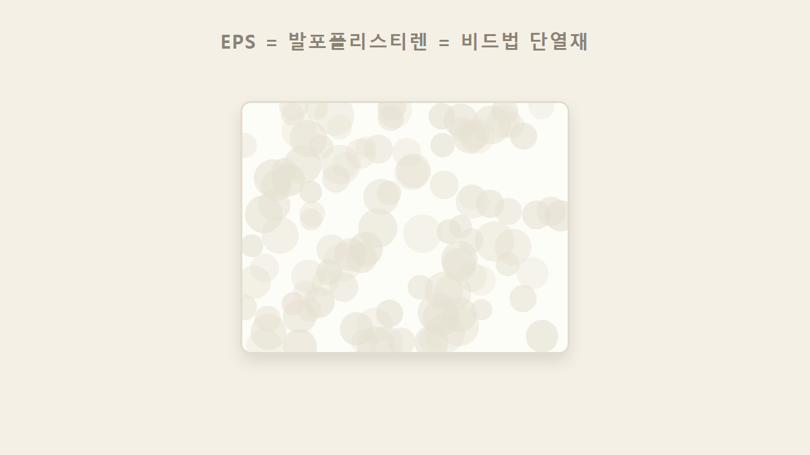

EPS의 정식 명칭은 비드법, 발포폴리스티렌이다. 현장에서는 그냥 스티로폼이라고 부르지만, 이름 자체에 제조 방식이 그대로 들어있다 — 폴리스티렌 알갱이(비드)를 발포시켜 뭉친 것이 EPS다.

## 4. EPS 세 갈래 — 1종·2종·준불연

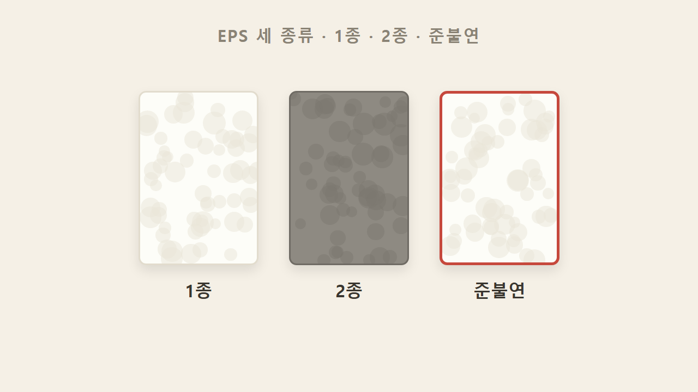

EPS는 한 종류만 있는 게 아니라 1종, 2종, 준불연 세 갈래로 나뉜다. 현장에서는 이 셋이 서로 다른 재료처럼 쓰이기 때문에 구분할 줄 알아야 한다.

## 5. 색으로 구분하는 1종과 2종

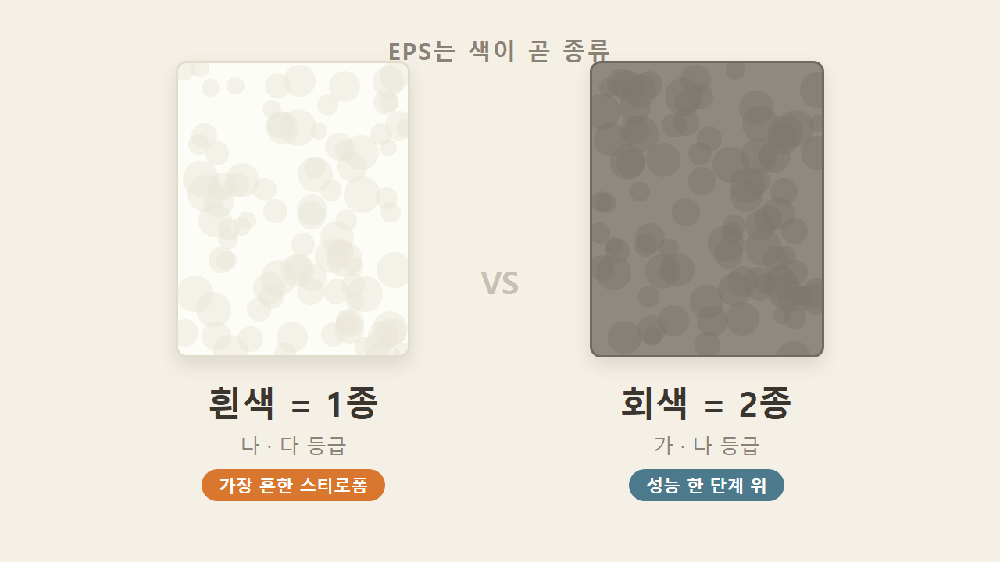

가장 쉬운 구분법은 색이다. 흰색이면 1종, 회색이면 2종이다. 1종 안에는 나등급·다등급이 있고, 2종 안에는 가등급·나등급이 있다.

> 교정 참고: 원문 메모에는 1종에 "나·다·라 등급"이라 적혀 있었지만, 국토부 고시 등급표 기준으로 보면 1종에 해당하는 라등급 제품은 없다. 실제 1종의 등급은 나·다등급까지다.

## 6. 1종·2종은 난연 등급

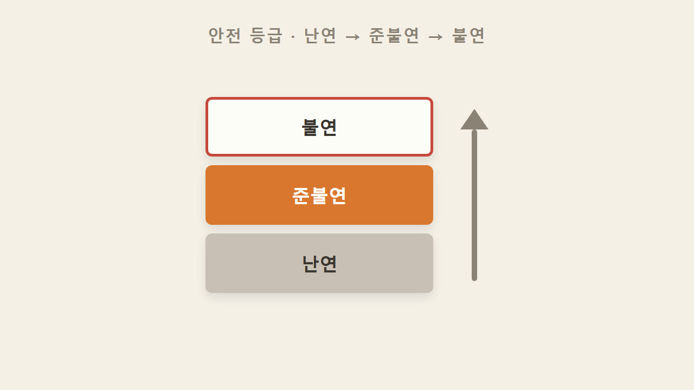

1종과 2종은 둘 다 '난연' 등급에 속한다. 불에 잘 타지 않는 성질을 갖고 있지만, 안전 등급으로 줄을 세우면 난연은 준불연보다 한 단계 아래다. 안전 등급은 낮은 순서대로 난연 → 준불연 → 불연으로 올라간다.

## 7. 열효율 등급 — 가·나·다·라

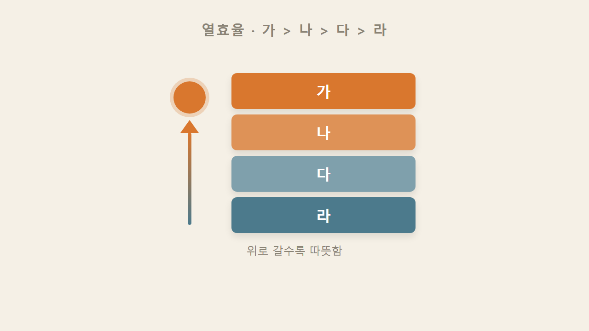

단열재 등급은 가·나·다·라 네 단계다. 가등급이 열효율이 제일 높고(제일 따뜻하고), 라등급이 제일 낮다. "가에 가까울수록 따뜻하다"고 단순하게 외우면 된다.

## 8. 호수 — 1호~4호, 밀도 기준

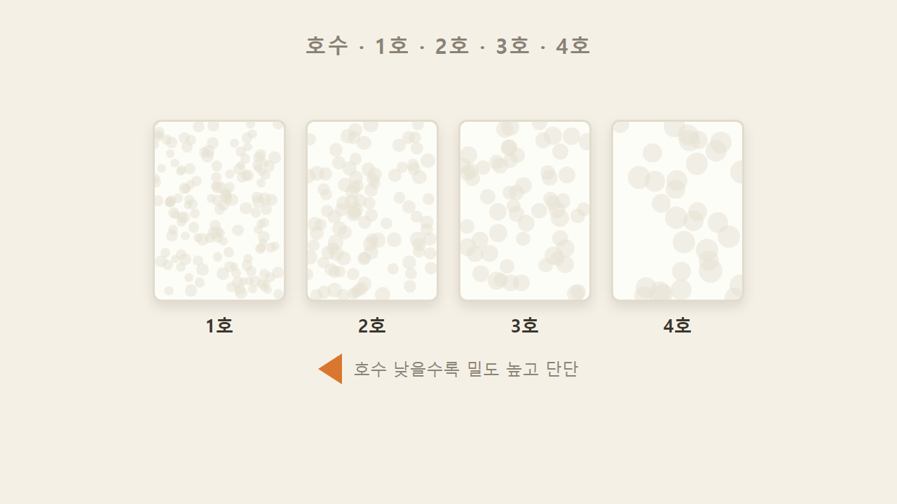

등급과는 별개로 1종·2종의 등급 분류는 1호~4호로도 나뉜다. 이건 밀도 기준으로, 호수가 낮을수록(1호에 가까울수록) 밀도가 높고 더 단단하다. 어떤 호수가 어떤 등급에 들어가는지 표로 정리하는 건 다른 소재까지 배운 뒤 EP3에서 한 번에 다룬다. 여기서는 "가나다라는 열효율 순서, 1호~4호는 밀도 순서"라는 두 축만 구분해두면 된다.

## 9. 손으로 느끼는 밀도 차이

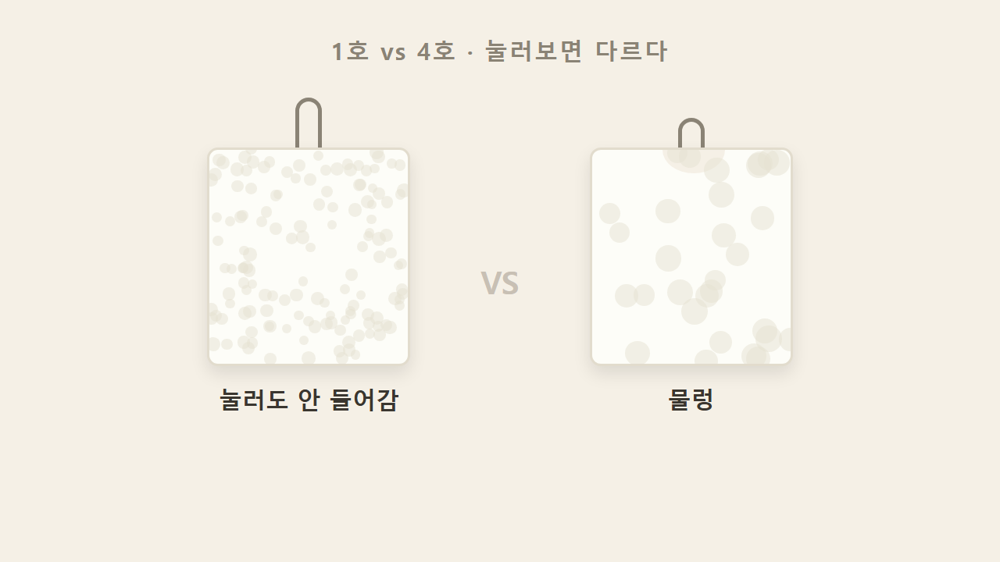

호수에 따른 밀도 차이는 실제로 만져보면 확연하다. 1호는 눌러도 거의 안 들어가는 반면, 4호는 누르는 느낌부터 물렁하게 다르다.

## 10. 준불연 기준 — 10분의 의미

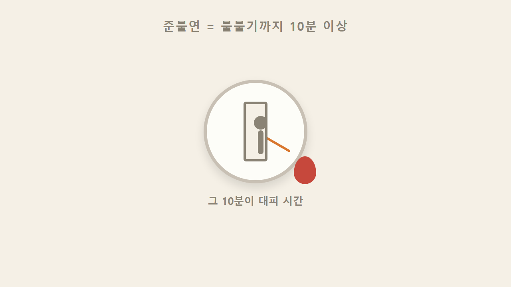

준불연은 화재가 났을 때 단열재에 불이 붙기까지 걸리는 시간이 최소 10분 이상이어야 한다는 기준을 충족하는 것을 말한다. 이 10분이 의미 있는 이유는 사람이 대피하는 시간이기 때문이다. 단열재가 바로 불이 붙어 번지면 대피할 시간이 없지만, 10분 이상 버텨주면 그 사이에 빠져나올 수 있다.

## 11. 준불연 가·나 등급

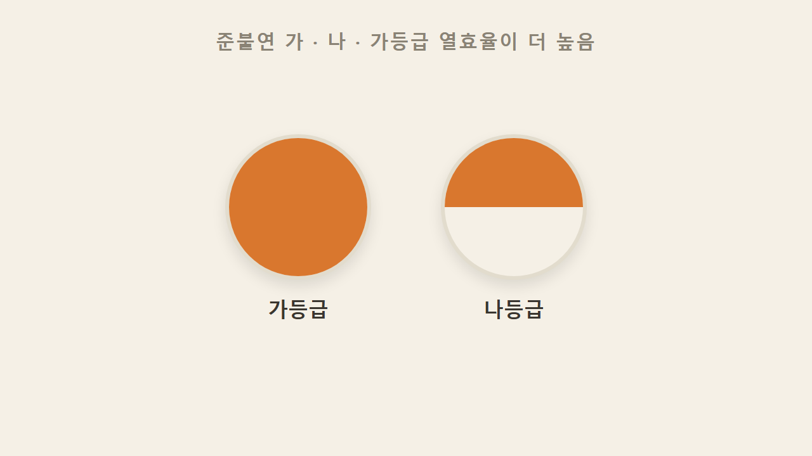

비드 계열 준불연(EPS 준불연) 안에도 가등급·나등급이 나뉜다. 구분 기준은 열효율이며, 가등급의 열효율이 나등급보다 높다.

## 12. 심재형 vs 1면 준불연

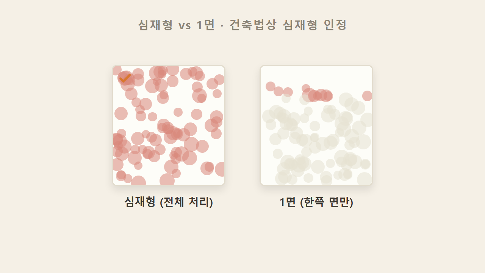

같은 준불연이라도 처리 방식이 다르다. 심재형은 비드 알갱이 자체에 준불연 처리가 들어간 것이고, 1면 준불연은 한쪽 면에만 처리가 된 것이다. 현행 건축법상으로는 심재형 준불연을 적용해야 하며, 준불연 딱지가 붙어있어도 처리 방식이 다르면 법적으로 인정되지 않을 수 있다.

> 검증 참고: 2021-12-23 시행령 개정으로 심재 준불연 의무화가 실제로 맞다. 다만 이 의무는 모든 건물이 아니라 특정 용도·규모 이상 건축물이 대상이며, 5층 이하·22m 미만 등 일부 저층 건물은 난연으로 완화되는 경우가 있다.

### 한 줄 정리

흰색은 1종, 회색은 2종이고 둘 다 난연이다. 열효율은 가>나>다>라 순으로 가등급이 제일 높고, 호수는 낮을수록 밀도가 높고 단단하다. 준불연은 화재 시 10분 이상 버티는 기준을 충족하는 것이며, 건축법상 일정 규모·용도 이상 건물엔 알갱이에 처리가 들어간 심재형 준불연을 적용해야 한다.

### 셀프 체크

1. 현장에서 회색 스티로폼 단열재를 봤다. 몇 종일까?
2. 가·나·다·라 중에서 열효율이 제일 높은 등급은?
3. 건축법상 적용해야 하는 준불연 형태는 심재형과 1면 중 무엇일까?

**정답**
1. 2종 (흰색=1종, 회색=2종)
2. 가등급 (가에 가까울수록 따뜻하다)
3. 심재형 준불연 (알갱이 자체에 처리가 들어간 것. 1면짜리는 인정되지 않을 수 있다)
