# EP2 — 소재 비교 + 물 (XPS·PF·불연재, 지상이냐 지중이냐)

> 영상 EP2의 학습용 텍스트판. 화면·순서가 영상과 1:1. 원문 출처: [00_원문소스.md](00_원문소스.md)

## 1. 오늘의 핵심 — 물을 먹느냐 안 먹느냐

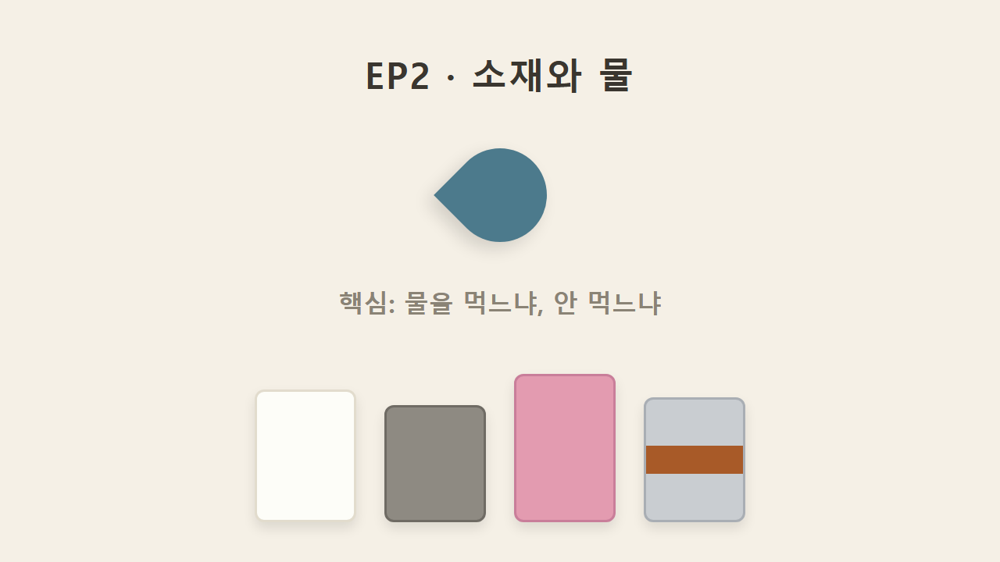

EP1에서는 등급 얘기를 했다면, 이번 편은 소재 얘기다. 소재별로 성질이 달라서 쓰는 위치도 완전히 갈리는데, 오늘의 핵심은 딱 하나 — "이 소재가 물을 먹느냐, 안 먹느냐"다.

## 2. 스펀지 비유 — 흡수 vs 비흡수

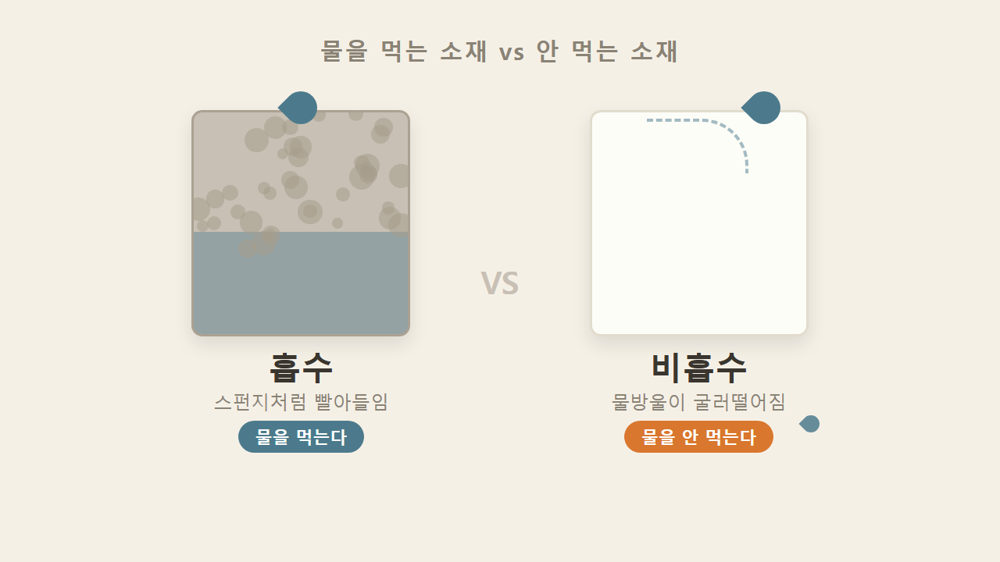

스펀지를 떠올리면 이해가 쉽다. 물을 흡수하는 것도 있고, 안 하는 것도 있다. 단열재도 마찬가지라서 이 성질에 따라 쓸 곳이 지상이냐 지중이냐로 갈린다.

## 3. 지상/지중 구분 — 땅속은 늘 습기와 물

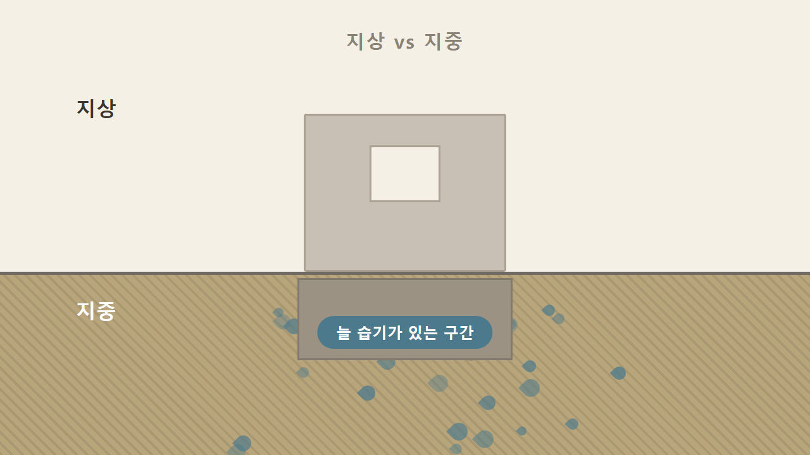

지중은 기초 옆처럼 땅속에 묻히는 부분을 말하며, 이곳은 항상 습기가 있고 물과 맞닿아 있다. 물을 먹는 소재를 땅속에 묻으면 흠뻑 젖어서 단열 기능이 떨어진다. 그래서 소재별로 지상에 쓰는 것과 지중에 쓰는 것이 나뉜다.

## 4. 비드법(EPS) — 지상 적용, 몰탈본드 바로 부착

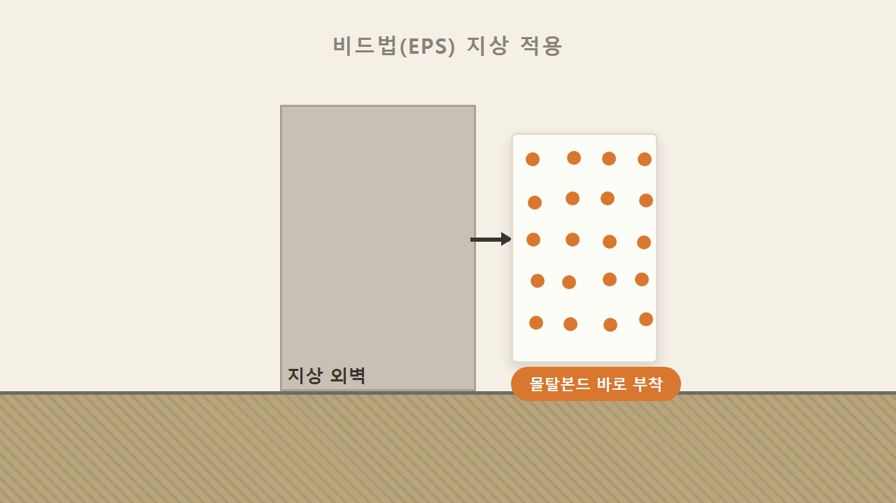

비드법(EPS)은 수분을 흡수하는 소재다. 그래서 땅속이 아니라 지상, 즉 외벽에 붙인다. 시공도 편해서 접착 몰탈인 몰탈본드를 별도 처리 없이 바로 붙일 수 있다.

## 5. XPS — 지중 적용, 물 안 먹음

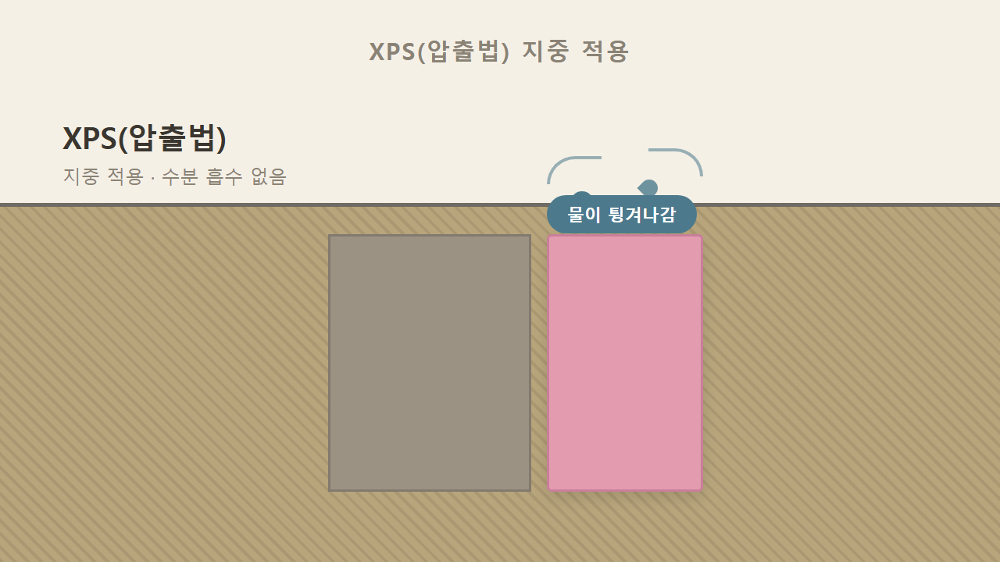

XPS는 압출법, 압출폴리스티렌이라 부른다. 비드법과 달리 수분 흡수율이 없어서 물을 먹지 않으며, 그래서 기초 옆이나 지하 벽체 같은 지중 부위에 쓴다. 현장에서는 핑크색이나 옐로우 컬러로 유통되어 색으로도 구분할 수 있다.

## 6. 비드법 = 지상 / XPS = 지중 (색상 비교)

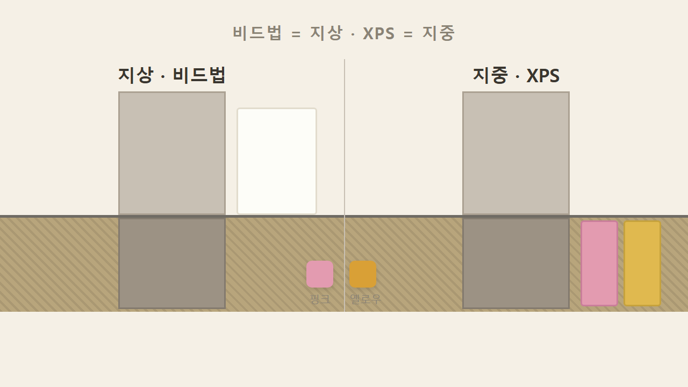

비드법과 XPS를 나란히 놓고 보면 성질이 정반대다. 비드법은 지상, XPS는 지중. 공사 현장에서 보이는 분홍색 단열재가 바로 이 XPS다.

## 7. XPS 열효율 — 비드법보다 좋음

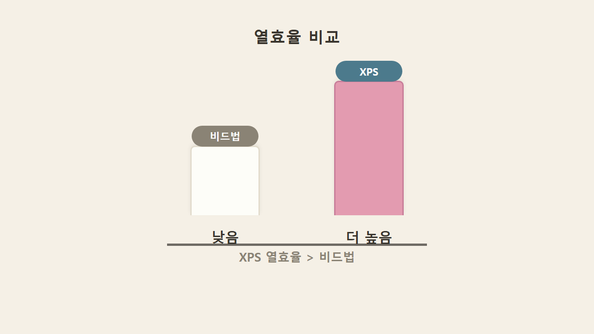

성능 면에서도 XPS는 비드법보다 열효율이 좋다. 지중용이라는 위치뿐 아니라 열을 막는 성능 자체도 한 단계 위라는 얘기다.

## 8. XPS 시공 순서 — 비흡수 프라이머 → 메쉬미장

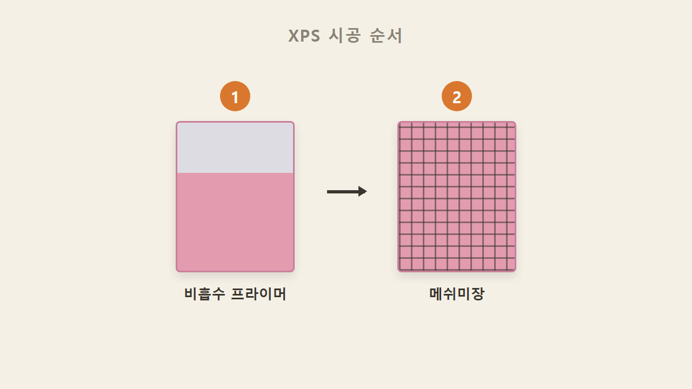

다만 메쉬미장을 할 때는 비드법처럼 바로 진행하지 않는다. XPS는 비흡수 프라이머를 먼저 바른 뒤에야 메쉬미장을 할 수 있다.

## 9. PF(페놀폼) — 준불연, 양면 은박

PF는 페놀폼이며 준불연 단열재다. EP1에서 다룬 난연-준불연-불연 등급 중 준불연에 들어가는 소재다. 생긴 모습이 특이한데, 양면에 은박지가 붙어 있다.

## 10. 물 침투 → 페놀폼 흡수 → 건조 오래 걸림

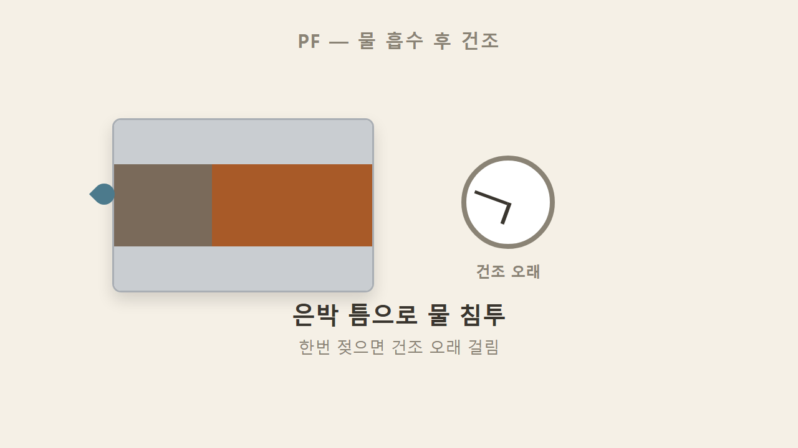

물이 닿으면 은박지 사이로 침투해서 안의 페놀폼이 스펀지처럼 물을 빨아들인다. 문제는 한번 물을 먹으면 건조되는 데 시간이 엄청 걸린다는 것 — 그래서 시공할 때 물 노출을 조심해야 한다.

## 11. 소재별 열효율 순위 — PF > XPS > 비드법

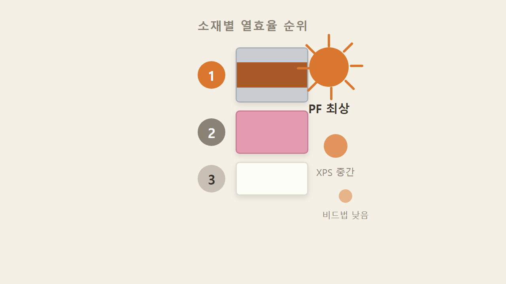

이런 단점에도 PF를 쓰는 이유는 열효율이 소재들 중에서 제일 좋기 때문이다. 순위로 보면 PF가 1위, 그 아래가 XPS, 비드법이 가장 아래다.

## 12. 그라스울·미네랄울 = 불연 / 열효율 1위와 불연 1위는 다른 얘기

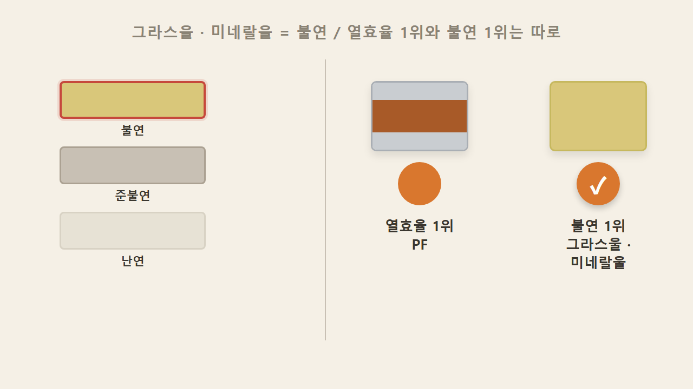

열효율이 최고라고 해서 아무 데나 쓸 수 있는 건 아니다. 아예 불에 안 타야 하는 곳은 그라스울, 미네랄울 같은 불연 단열재를 써야 한다. 난연-준불연-불연 사다리의 맨 꼭대기 자리가 바로 이 둘이다. 정리하면 열효율 1위는 PF, 불연 1위는 그라스울·미네랄울로 서로 다른 기준의 1위다. 용도에 따라 선택이 달라진다.

### 한 줄 정리

비드법은 물을 먹어서 지상용이고 몰탈본드를 바로 붙일 수 있다. XPS는 물을 안 먹어서 지중용이고 열효율도 비드법보다 위다. PF는 열효율이 소재 중 최고이지만 물이 들어가면 건조가 오래 걸린다. 그라스울·미네랄울은 아예 타지 않는 불연재다.

### 셀프 체크

1. 땅속에 묻는 단열재는 무엇일까?
2. 소재 중에 열효율이 가장 좋은 것은?
3. 물을 흡수해서 지상에만 쓰는 소재는?

**정답**
1. XPS (수분 흡수율이 없어서 지중에 쓴다)
2. PF (페놀폼, 열효율 소재 중 1위)
3. 비드법(EPS) (수분을 흡수하기 때문에 지상 적용)
