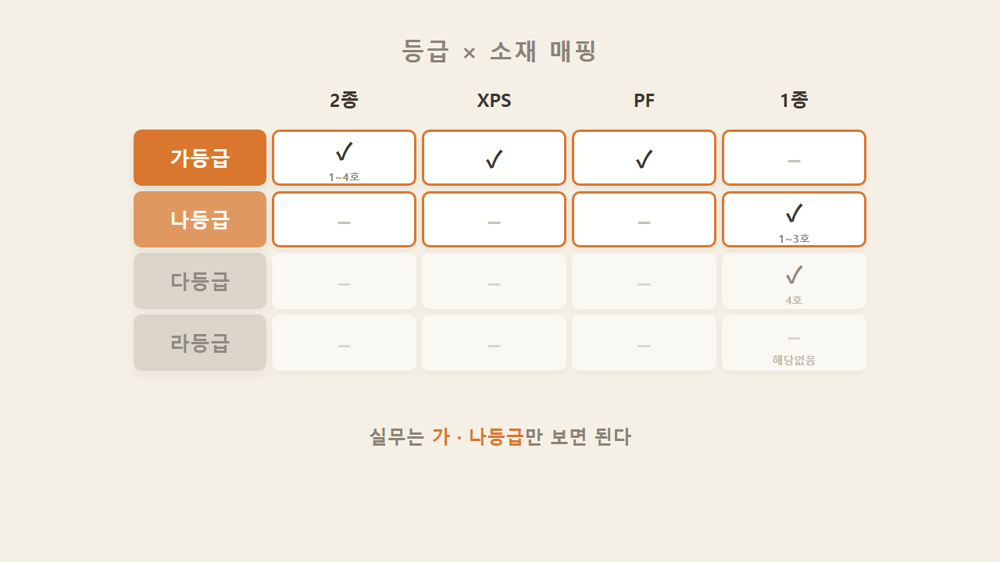
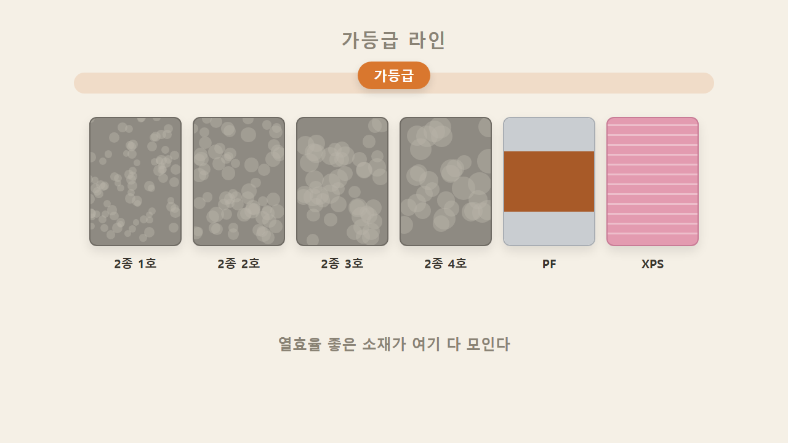
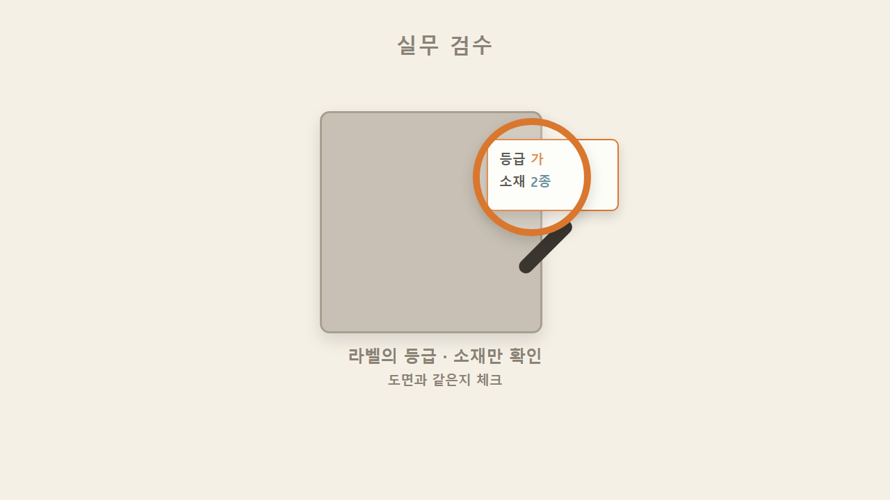
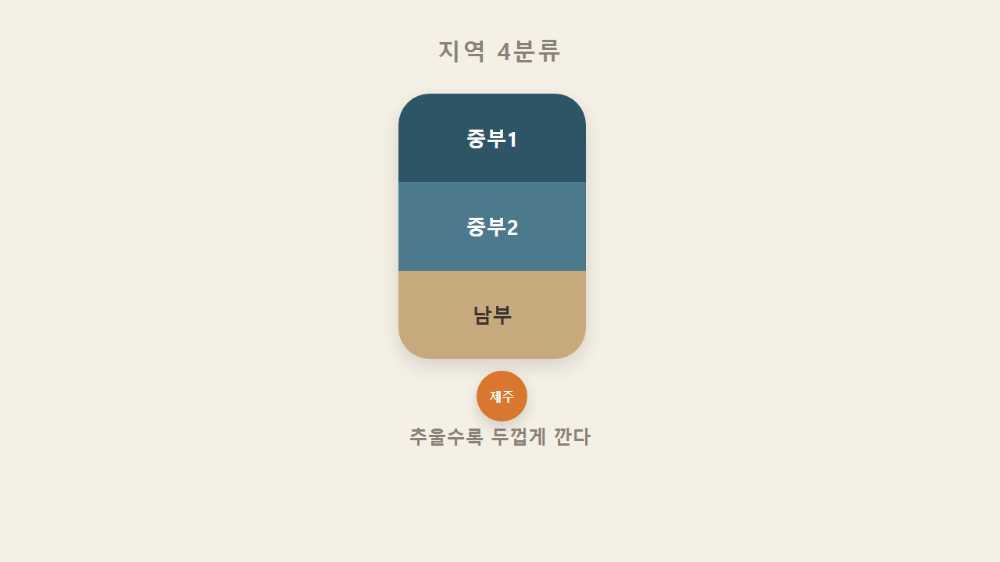
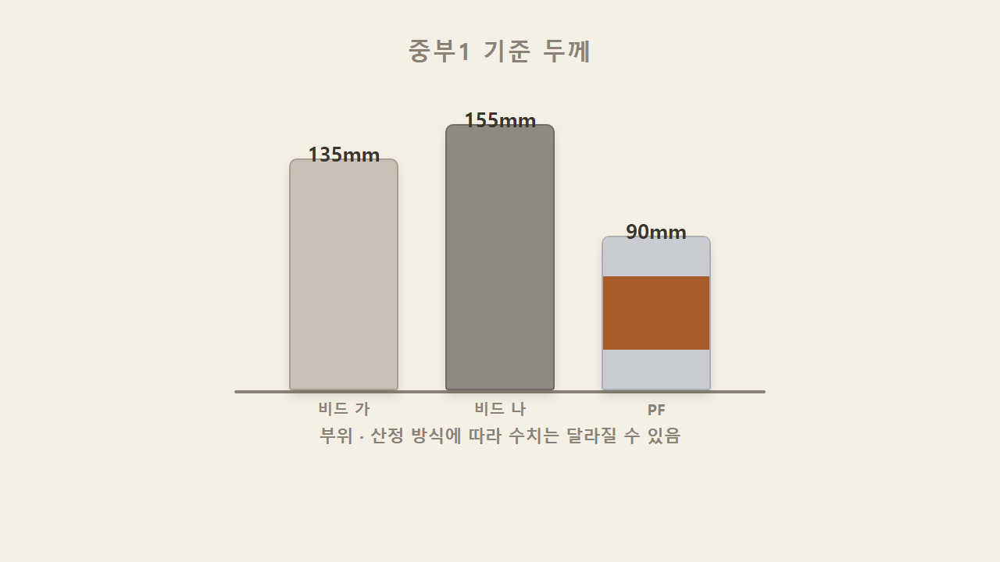
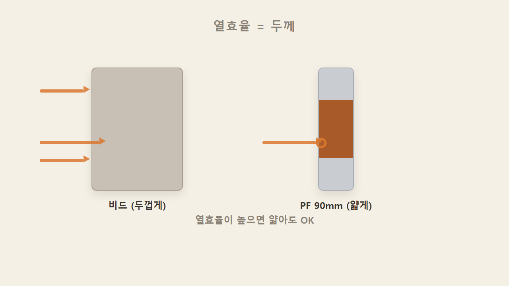
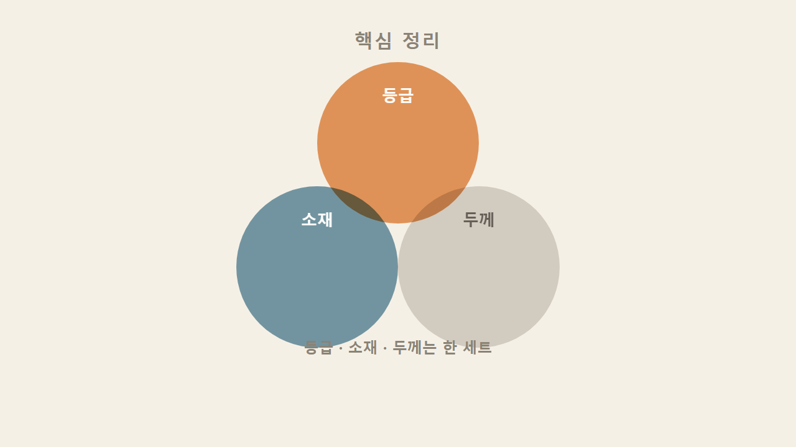

# EP3 — 등급 총정리 + 지역별 두께 (나선형 회수·복습편)

> 영상 EP3의 학습용 텍스트판. 화면·순서가 영상과 1:1. 원문 출처: [00_원문소스.md](00_원문소스.md)

## 1. 복습 — 흰색 1종·회색 2종, 호수는 낮을수록 단단

EP1과 EP2에서 등급과 소재를 각각 배웠다면, 이번 편은 그 둘을 매핑표로 합치는 편이다. 시작하기 전에 몸풀기로 하나만 다시 짚는다 — 흰색은 1종, 회색은 2종이고, 호수는 낮을수록 밀도가 높고 단단하다는 것.

## 2. 등급 × 소재 매핑표 — 실무는 가·나등급만

가·나·다·라 등급에 각 소재가 어떻게 배치되는지 표로 정리하면, 실무에서 신경 써야 할 건 가등급과 나등급 두 줄뿐이다. 다등급과 라등급은 표에서도 흐리게 처리해둘 만큼 현장에서 챙길 일이 거의 없다.

## 3. 가등급 라인 — 2종 전 호수 · XPS · PF

가등급 먼저 보면, 회색 2종은 1호부터 4호까지 호수와 상관없이 전부 가등급이다. 여기에 XPS와 PF까지 더해지는데, EP2에서 배운 것처럼 열효율이 좋은 소재들이 가등급에 모이는 것이다. 참고로 2종에도 가·나 등급이 있다고 했던 나등급은 준불연 계열 제품 얘기로, 두께 부분에서 나등급 155mm로 다시 나온다.

## 4. 나등급 = 1종 1~3호 / 다등급 = 1종 4호

흰색 1종은 회색 2종보다 한 단계 아래라 나등급부터 시작한다 — 1종 1호, 2호, 3호가 나등급이다. 같은 1종 안에서도 밀도가 제일 낮은 4호만 다등급으로 한 칸 더 내려간다. 라등급에는 비드법 계열이 아예 없고, 다등급인 1종 4호는 현장에서 거의 쓰지 않는다.

> 교정 참고: 원문 메모의 등급 매핑(가등급=1종1호·2종1·2호·XPS·PF / 나등급=1종2호·2종3·4호 / 다등급=1종3호 / 라등급=1종4호)은 국토부 고시 단열재 등급표와 대조했을 때 행이 밀린 오기로 판단해 위 내용으로 교정했다. 근거는 비드법 2종은 전 호수가 가등급, 1종 1~3호가 나등급, 1종 4호가 다등급이라는 등급표 기준.

## 5. 실무 검수 — 라벨의 등급·소재만 확인

자재가 현장에 들어오면 라벨에 등급과 소재가 찍혀 있다. 검수할 때는 그 라벨이 가·나등급이 맞는지, 도면에 적힌 소재와 같은지만 확인하면 된다.

## 6. 지역 4분류 — 중부1·중부2·남부·제주

단열재 두께는 지역마다 다르다. 우리나라는 현재 중부1, 중부2, 남부, 제주 4개 구역으로 분류되며, 추운 지역일수록 단열재를 더 두껍게 깐다.

## 7. 중부1 기준 소재별 두께 — 135 / 155 / 90mm

중부1 기준으로 보면 가등급이 135mm라는 식으로 두께 기준이 있는데, 여기서 중요한 건 같은 가등급이라도 소재별로 두께가 또 달라진다는 점이다. 비드 준불연 가등급은 135mm, 비드 준불연 나등급은 155mm, PF 준불연은 90mm다.

> 검증 참고: 법정 별표3 기준 중부1 외벽(외기 직접) 가등급 두께는 190mm(공동주택은 220mm)로, 위 135/155/90mm 수치와는 차이가 있다. 이 수치들은 부위나 열관류율 역산에 따른 실무 설계값으로 추정되며, 부위·산정 방식에 따라 실제 두께는 상이할 수 있다.

## 8. PF가 얇아도 되는 이유 — 열효율이 높으면 두께는 낮아진다

PF는 열효율이 소재 중 1등이기 때문에 열을 그만큼 잘 막아서 얇아도 된다. 반대로 열효율이 상대적으로 낮은 소재는 두께로 보완한다 — 비드 나등급이 155mm로 제일 두꺼운 것도 나등급이 가등급보다 열효율이 떨어지기 때문이다.

## 9. 마무리 — 등급·소재·두께는 한 세트

같은 가등급이라도 어떤 소재를 쓰느냐에 따라 실제 공사 두께가 달라진다. 그래서 설계할 때도, 현장 검수할 때도 등급 하나만 보고 판단하면 안 되고 등급·소재·두께 세 가지를 함께 확인해야 실수가 없다. 등급 있고, 소재 있고, 지역 기준 있고 — 이 세 가지를 맞춰 보는 것이 외단열 단열재 이야기의 뼈대다.

### 한 줄 정리

가등급에는 2종(1~4호)·XPS·PF가 들어가고 1종은 나등급(1~3호)·다등급(4호)이다. 중부1 가등급 기준 두께는 소재에 따라 비드 준불연 가등급 135mm / 비드 준불연 나등급 155mm / PF 준불연 90mm로 달라진다.

### 셀프 체크

1. 가등급에 들어가는 소재를 두 개만 말하면?
2. 중부1 기준 비드 준불연 나등급 두께는?
3. PF 준불연은 몇 mm일까?

**정답**
1. XPS, PF (회색 2종도 호수 상관없이 가등급)
2. 155mm
3. 90mm (등급·소재·두께가 한 세트로 움직인다는 점이 핵심)
