# EP4 — 메쉬 종류 전부 (일반 → 보강 → 토목)

> 영상 EP4의 학습용 텍스트판. 화면·순서가 영상과 1:1. 원문 출처: [00_원문소스.md](00_원문소스.md)

## 1. 표지 — 단열재 판 다음은 메쉬

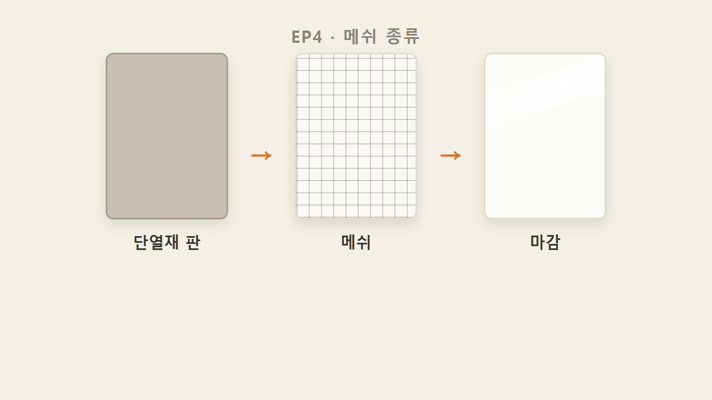

단열재 판을 벽에 붙이는 것까지가 EP1~3의 내용이었다면, 판만 붙이고 끝나는 게 아니다. 판 다음에는 그 위에 메쉬를 덮는 공정이 이어진다. 이번 편은 이 메쉬를 처음부터 끝까지 훑는다.

## 2. 화이버글라스메쉬(Fiber Glass Mesh)

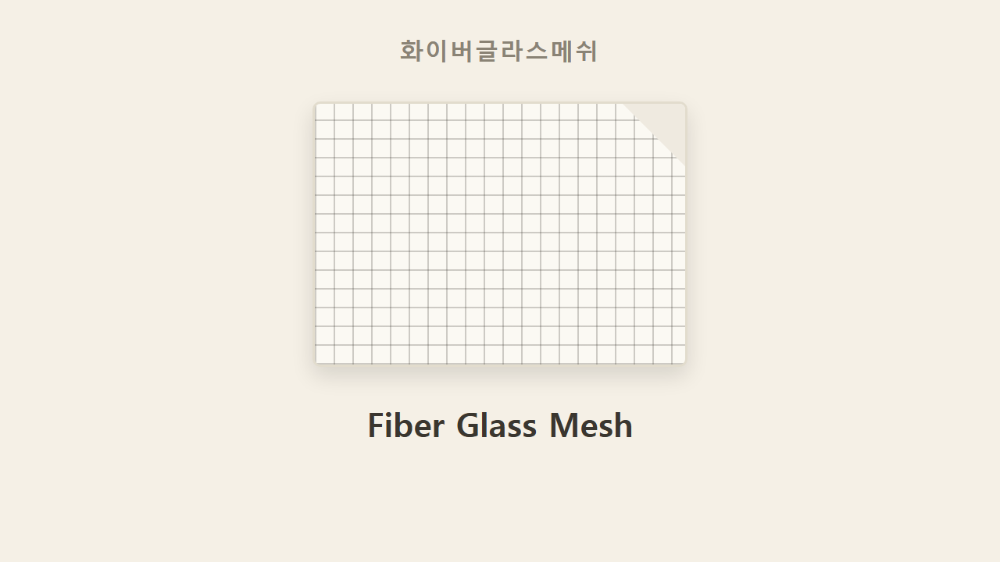

오늘 다루는 메쉬의 이름은 화이버글라스메쉬, 영어로는 Fiber Glass Mesh다.

## 3. 분류 기준 2축 — 용도와 중량

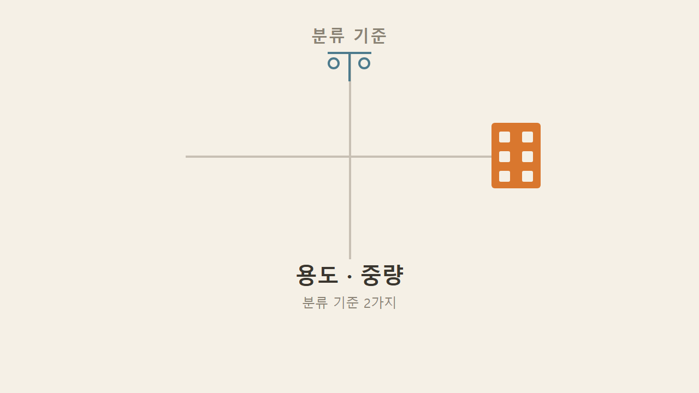

이 메쉬를 나누는 기준은 용도와 중량, 두 가지다.

## 4. 화이버글라스메쉬 3형제 — 일반·보강·토목

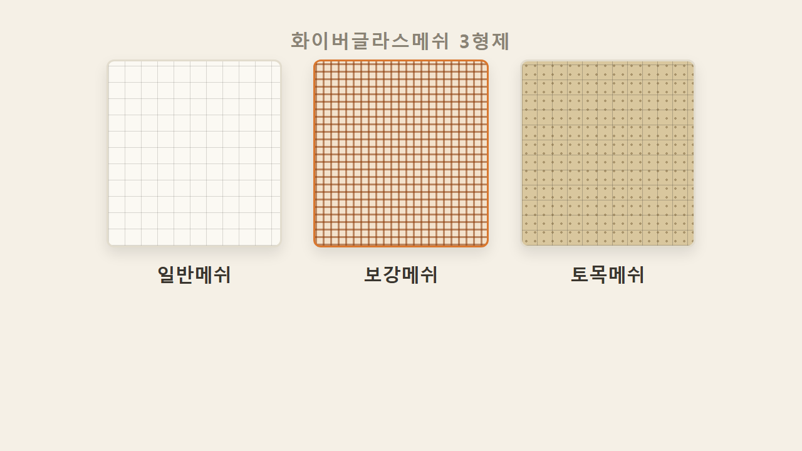

용도와 중량을 기준으로 나누면 일반메쉬, 보강메쉬, 토목메쉬 세 종류로 갈린다. 역할을 먼저 잡아두면, 일반메쉬는 단열재면에 내구성을 확보하는 것(단열재 위를 덮어 면을 보호), 보강메쉬는 일반메쉬 대비 내구성이 200%라 더 강하게 잡아줘야 하는 부위에 쓰는 것, 토목메쉬는 결이 아예 달라서 보강토블럭으로 축대나 담장을 쌓을 때 쓰는 지중 메쉬다.

## 5. 일반메쉬 — 130g과 152g, 색으로도 구분

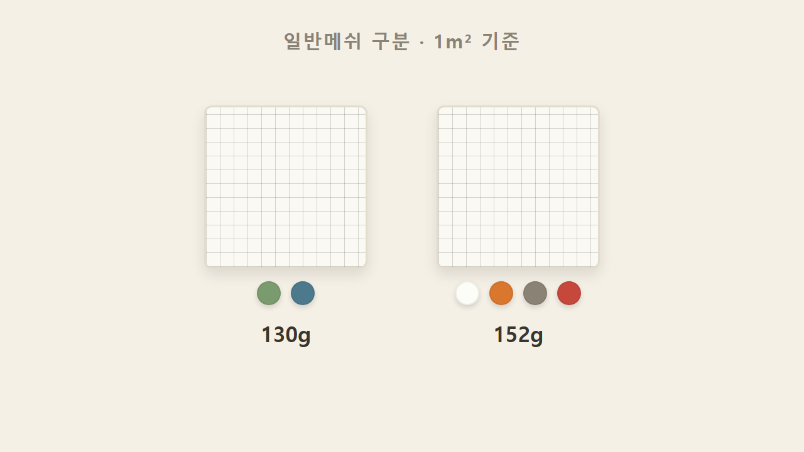

일반메쉬는 중량으로 구분한다. 1m² 기준으로 130g과 152g 두 가지다. 130g은 녹색·청색, 152g은 흰색·주황색·회색·빨강색으로 유통된다. 색깔은 제조사마다 조금씩 다를 수 있어서 굳이 외울 필요는 없고, 숫자(중량)가 더 중요하다.

## 6. 미·유럽 기준 152g 권장

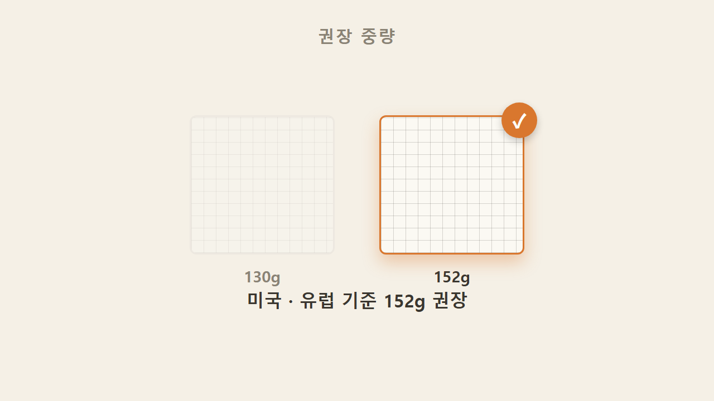

미국과 유럽 기준에서는 152g 사용을 추천하며, 현장에서도 보통 152g으로 진행한다.

> 검증 참고: "미·유럽 기준 152g 권장"이라는 내용은 공식 표준으로 확인된 근거는 없으며, 업계에서 통용되는 관행·유통 규격으로 이해하는 것이 정확하다.

## 7. 보강메쉬 — 250g 이상, 내구성 200%

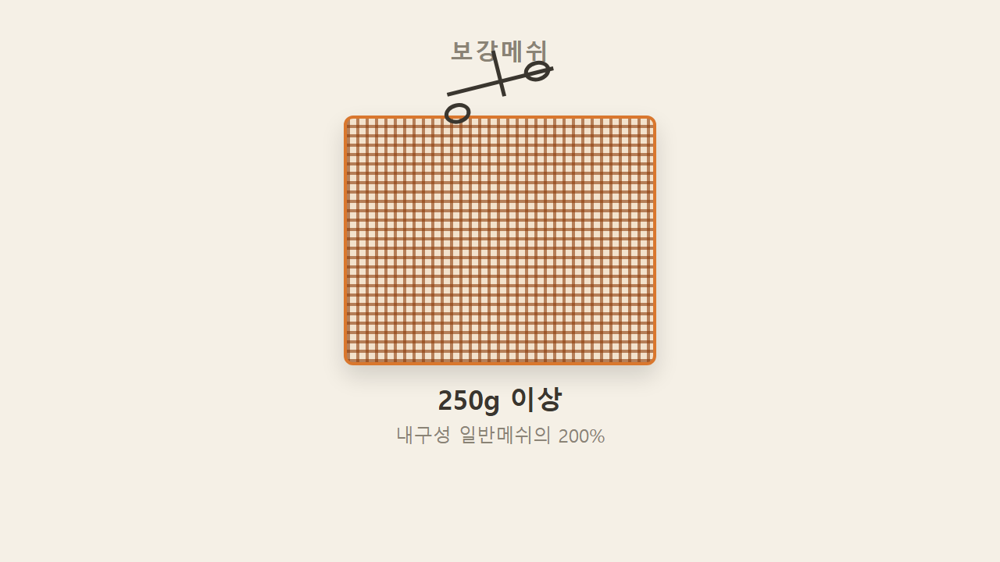

보강메쉬는 중량 기준이 250g 이상이다. 무게가 무겁다는 건 그만큼 재료가 더 들어갔다는 뜻이고, 이게 내구성 200%로 이어진다.

## 8. 대체가 아니다 — 일반메쉬 먼저, 보강메쉬는 추가

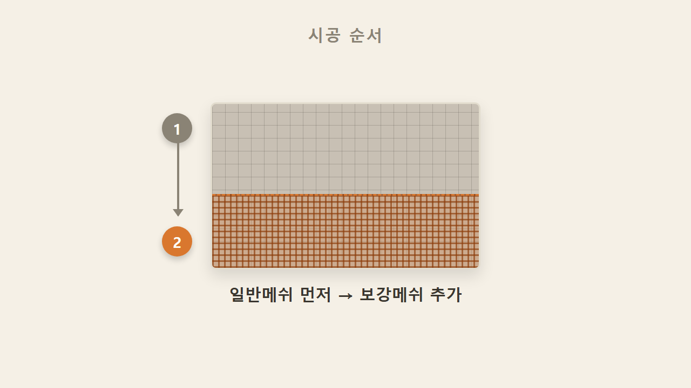

보강메쉬는 일반메쉬를 대체하는 게 아니다. 일반메쉬를 먼저 시공하고, 내구성이 더 필요한 부위에 추가로 올리는 순서다.

## 9. 보강메쉬 적용 높이 — 건물 하부 H1800

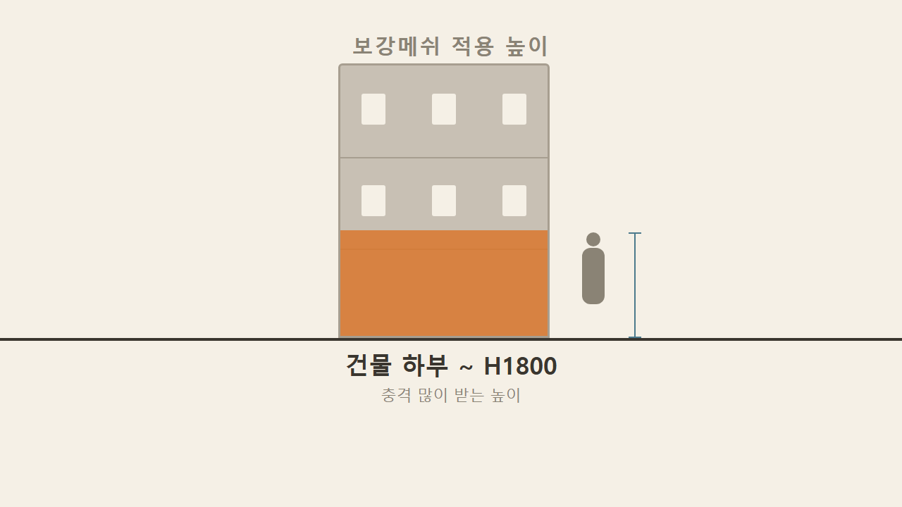

보강메쉬는 보통 건물 하부에서 H1800(높이 1,800mm)까지 설치한다. 사람 손이 닿거나 충격이 많이 가는 부위가 이 높이 안에 들어오기 때문이다. 그 위로 올리고 싶으면 요구 사항에 따라 옵션으로 추가 설치한다.

## 10. 보강메쉬의 단점 — 뻣뻣해서 시공이 까다롭다

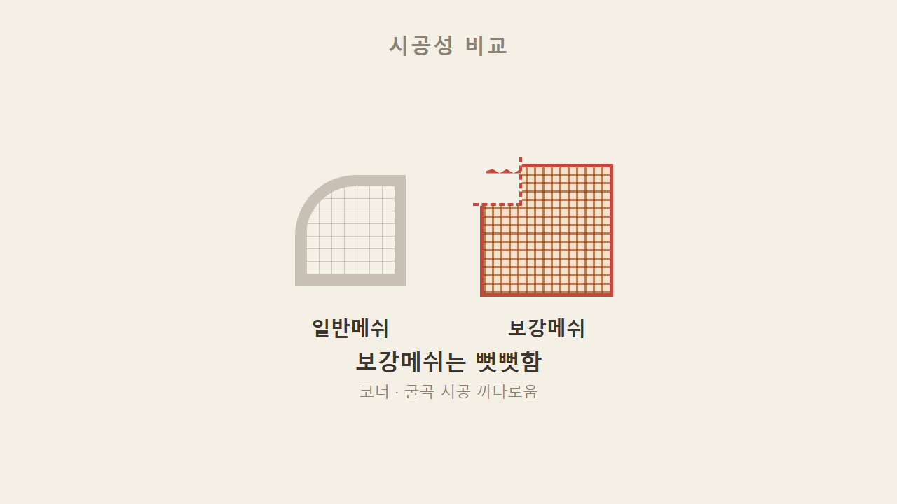

보강메쉬는 250g 이상으로 무겁다 보니 메쉬 자체 꺾임이 힘들다. 일반메쉬는 잘 구부러지는 반면 보강메쉬는 뻣뻣해서, 내구성은 좋지만 현장에서 다루기 까다롭고 손이 더 가는 작업이다.

## 11. 토목메쉬 — 보강토블럭 3단마다, 지중 사용

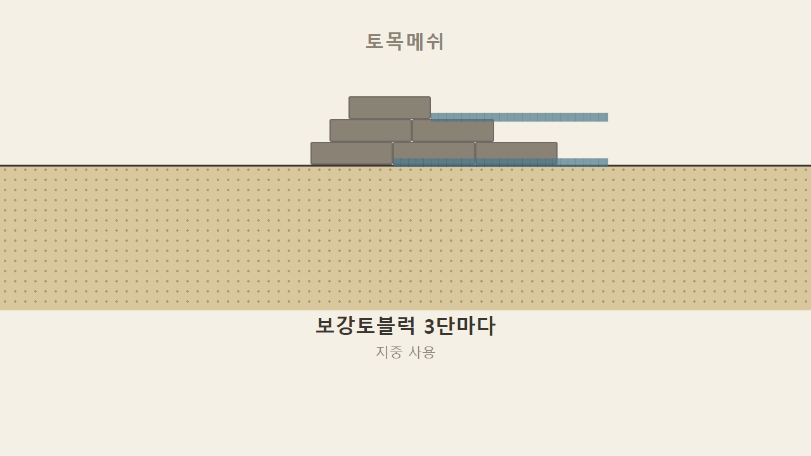

토목메쉬는 보강토블럭을 쌓을 때(축대, 담장 설치 시) 적용하는 메쉬다. 설치 방법은 보강토블럭을 3단마다 메쉬 한 장씩 깔면서 올라가는 방식이다.

> 검증 참고: "3단마다 설치"라는 간격 기준은 공식 표준으로 확인된 근거는 없으며, 설계도서나 시공사에 따라 상이할 수 있는 업계 관행으로 이해하는 것이 정확하다.

## 12. 참고만 — 외단열 벽 메쉬와는 결이 다르다

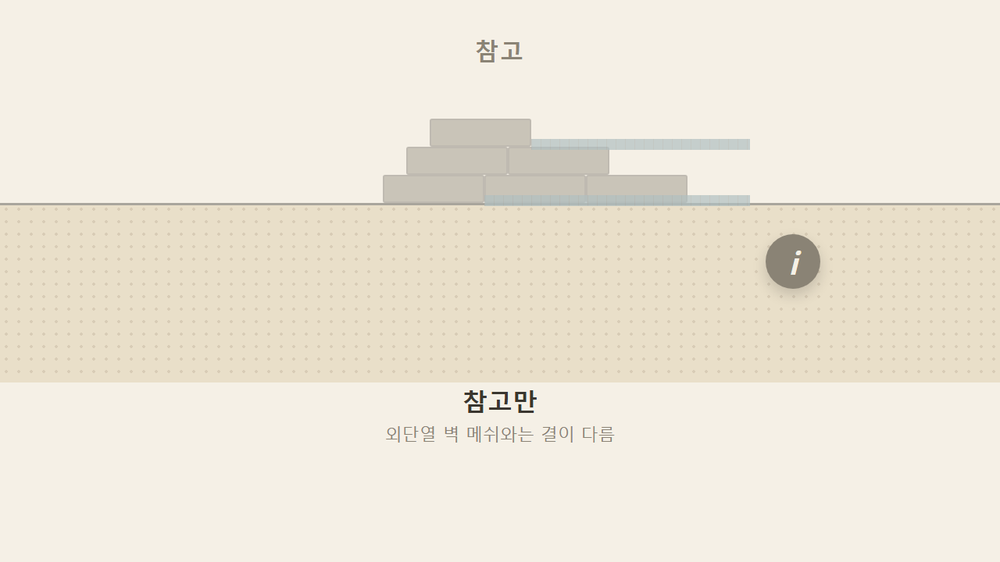

토목메쉬는 지중에 들어가는 메쉬라서 오늘 배운 외단열 벽면 메쉬 이야기와는 결이 다르다. 외단열 현장에서 직접 다룰 일은 거의 없지만, 화이버글라스메쉬 전체를 이야기할 때 빠지면 안 되는 항목이라 참고로 알아두면 된다. 정리하면 일반메쉬로 단열재면을 잡고, 보강메쉬로 하부 내구성을 올리고, 토목메쉬는 지중에서 따로 쓰는 것.

### 한 줄 정리

화이버글라스메쉬는 용도·중량으로 나뉘며, 일반메쉬는 130g(녹·청)과 152g(흰·주황·회·빨강)으로 구분되고 미·유럽 기준으로 152g을 권장한다. 보강메쉬는 250g 이상으로 일반메쉬 대비 내구성 200%이며 건물 하부 H1800까지 기본 설치하되 메쉬가 뻣뻣해 시공이 어렵다. 토목메쉬는 보강토블럭(축대·담장) 3단마다 설치하는 지중 메쉬로 참고만 한다.

### 셀프 체크

1. 미국·유럽 기준에서 권장하는 일반메쉬 중량은?
2. 보강메쉬는 중량이 어느 기준 이상일까?
3. 토목메쉬는 보강토블럭 몇 단마다 설치할까?

**정답**
1. 152g (130g이 아니라 152g이 권장 기준)
2. 250g 이상
3. 3단마다 (지중에 쓰는 메쉬라 외단열 벽 시공과는 참고용으로만 알아두면 된다)
