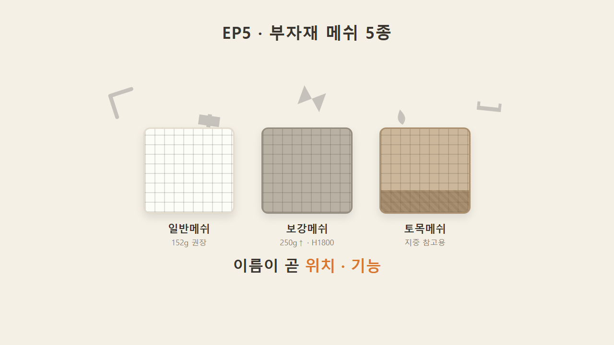
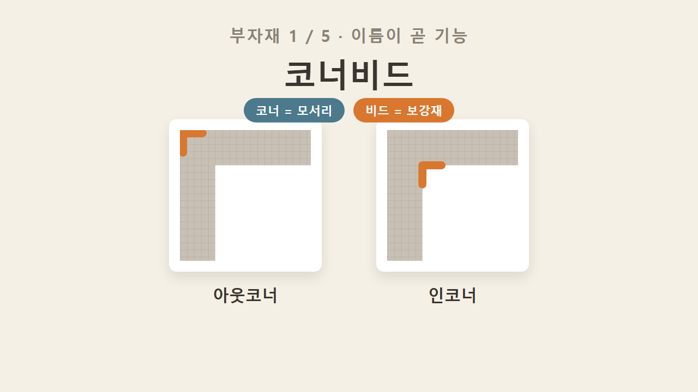
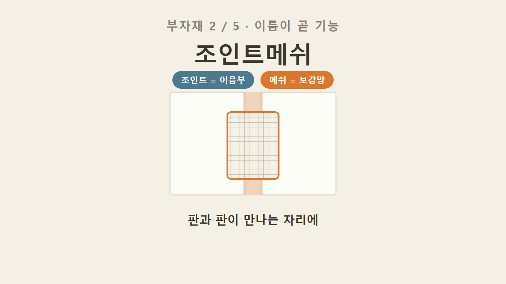
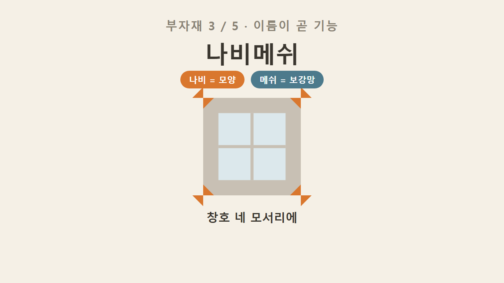
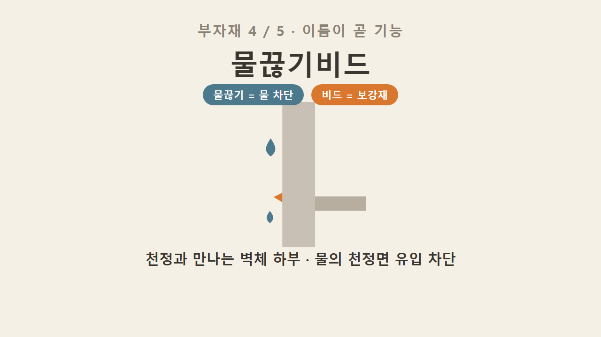
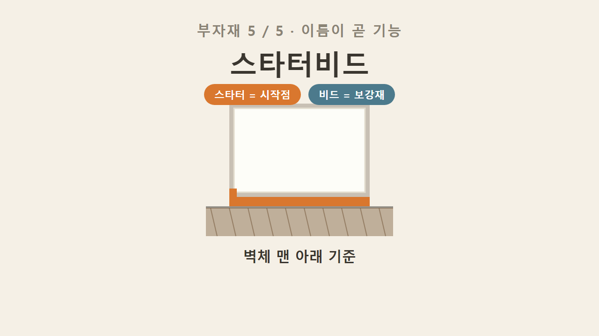
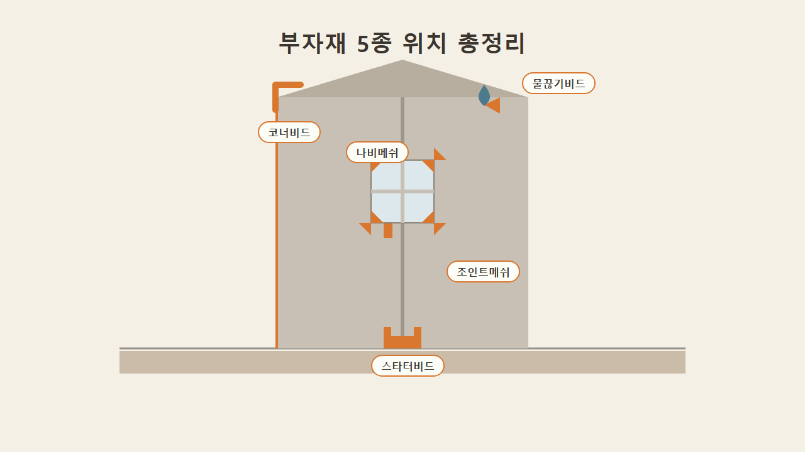
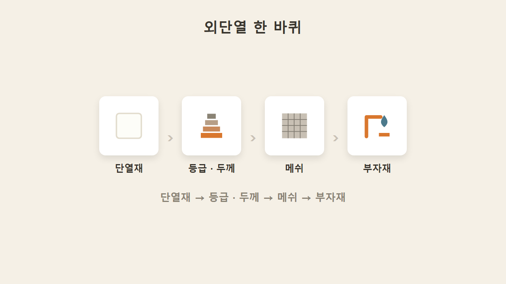

# EP5 — 부자재 메쉬 5종 (이름이 곧 기능)

> 영상 EP5의 학습용 텍스트판. 화면·순서가 영상과 1:1. 원문 출처: [00_원문소스.md](00_원문소스.md)

## 1. 복습 — 메쉬 3형제

EP4에서 배운 메쉬 3형제를 다시 짚고 시작한다. 일반메쉬는 130g·152g 중 미국·유럽 기준으로 152g을 권장하고, 보강메쉬는 250g 이상에 건물 하부 H1800까지 기본 설치하며, 토목메쉬는 보강토블럭 3단마다 지중에 쓰는 참고용 메쉬였다. 그 3형제가 메쉬 본체였다면, 이번 마지막 편은 그 외에 들어가는 부자재 메쉬 5종을 다룬다. 핵심은 하나 — 이름만 보면 위치와 기능이 다 나온다는 것.

## 2. 코너비드 — 모서리 보강재

코너는 모서리, 비드는 보강재를 뜻한다. 즉 코너비드는 모서리 내구성을 잡아주는 보강재다. 아웃코너, 인코너 둘 다에 쓰인다. 외단열에서 모서리는 충격도 받기 쉽고 마감도 신경 써야 하는 부위라 이걸 대준다.

## 3. 조인트메쉬 — 단열재 이음부용

조인트는 이음부를 뜻한다. 조인트메쉬는 단열재 판과 판이 만나는 조인부에 쓰는 메쉬다.

## 4. 나비메쉬 — 이름은 모양, 위치는 창호 코너

나비메쉬는 이름에 위치가 아니라 모양이 들어간 경우다. 메쉬 자체가 나비처럼 생겼다는 뜻이고, 위치는 창호 코너다. 창문 모서리 네 군데(위 둘, 아래 둘)에 각각 대준다.

## 5. 물끊기비드 — 천정 유입 방지

물끊기비드는 이름 그대로 물을 끊는, 즉 물이 못 지나가게 하는 부자재다. 위치는 천정과 연결되는 수직 벽체 하부이며, 벽을 타고 내려온 물이 천정면으로 유입되는 것을 막아준다.

## 6. 스타터비드 — 벽체 하부 시작점

스타터는 시작을 뜻한다. 스타터비드는 벽체 하부, 맨 아래에 적용하는 부자재다. 외단열 작업을 시작할 때 벽 아래에서 기준을 잡는 역할을 한다.

## 7. 부자재 5종 위치 종합

코너비드는 코너, 조인트메쉬는 판 이음부, 나비메쉬는 창호 코너, 물끊기비드는 천정 하부, 스타터비드는 벽 맨 아래 — 다섯 부자재를 위치별로 한 번에 놓고 보면 이름이 곧 설명서라는 게 더 분명해진다.

## 8. 시리즈 전체 흐름 — 단열재 → 등급·두께 → 메쉬 → 부자재

시리즈를 통으로 훑어보면 이렇다. 단열재는 EPS 흰색·회색이 물을 먹어서 지상용, XPS는 물을 안 먹어서 지중용, PF는 열효율 1등, 그라스울·미네랄울은 불연이었다. 등급·두께는 가나다라 열효율 순서에 중부1 기준으로 소재마다 달랐고 PF가 90mm로 가장 얇았다. 그 위에 덮는 것이 일반·보강·토목 3형제 메쉬였고, 여기에 오늘 배운 부자재까지 붙는다. 단열재 → 등급·두께 → 메쉬 → 부자재, 이게 외단열 한 바퀴다.

## 9. 마무리 — 이름 읽기가 현장의 열쇠

단열재가 벽에 붙는 원리를 알면 메쉬가 왜 필요한지 나오고, 메쉬를 알면 이 부자재들이 왜 거기 들어가는지 자연스럽게 이어진다. 이름 읽는 습관만 들이면 현장에서 처음 보는 부자재도 낯설지 않다.

### 한 줄 정리

부자재는 이름이 곧 위치·기능이다 — 코너(코너비드), 이음부(조인트메쉬), 창호 4코너(나비메쉬), 물끊기(물끊기비드), 시작점(스타터비드).

### 셀프 체크

1. 창호 코너 네 곳에 쓰는 메쉬는?
2. 천정면으로 물이 타고 들어오는 걸 막아주는 부자재는?
3. (시리즈 복습) 일반메쉬 권장 중량은?
4. (시리즈 복습) 물을 안 먹어서 지중에 쓰는 단열재는?

**정답**
1. 나비메쉬
2. 물끊기비드
3. 152g (미·유럽 기준)
4. XPS
