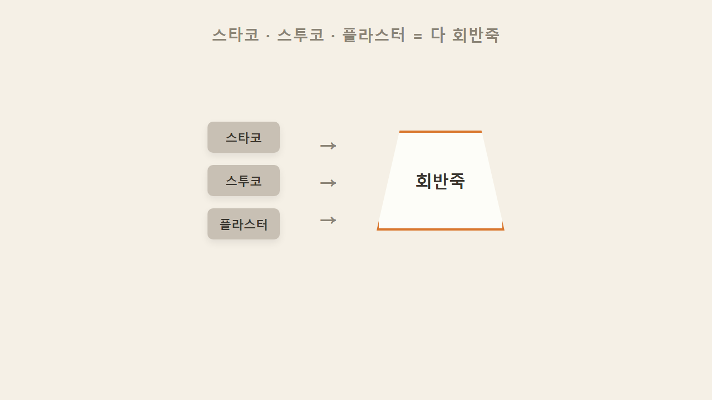
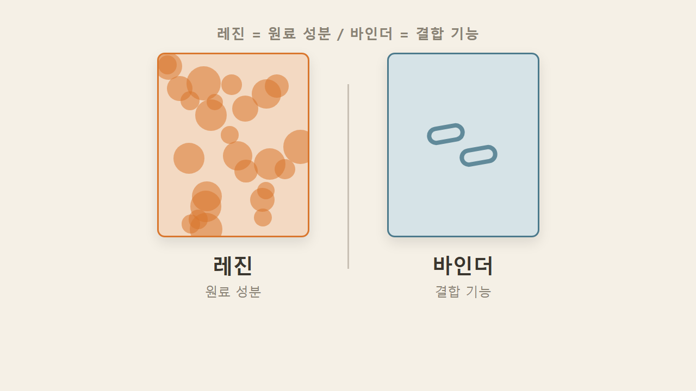
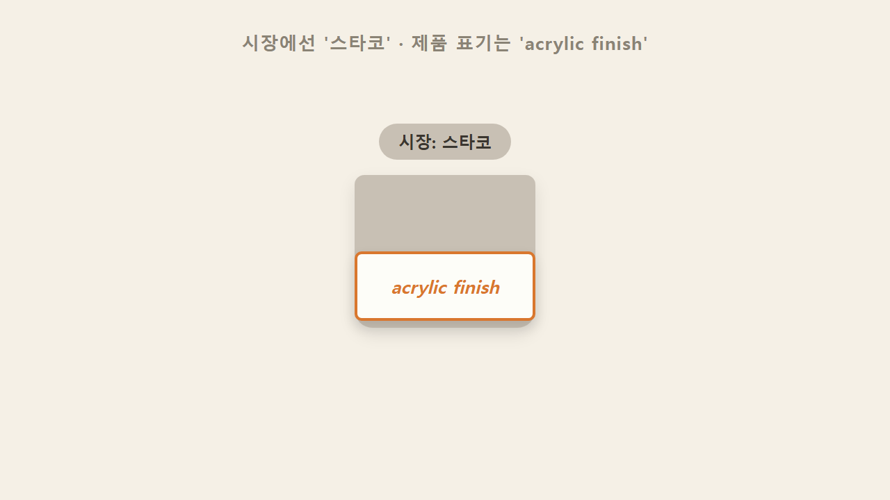
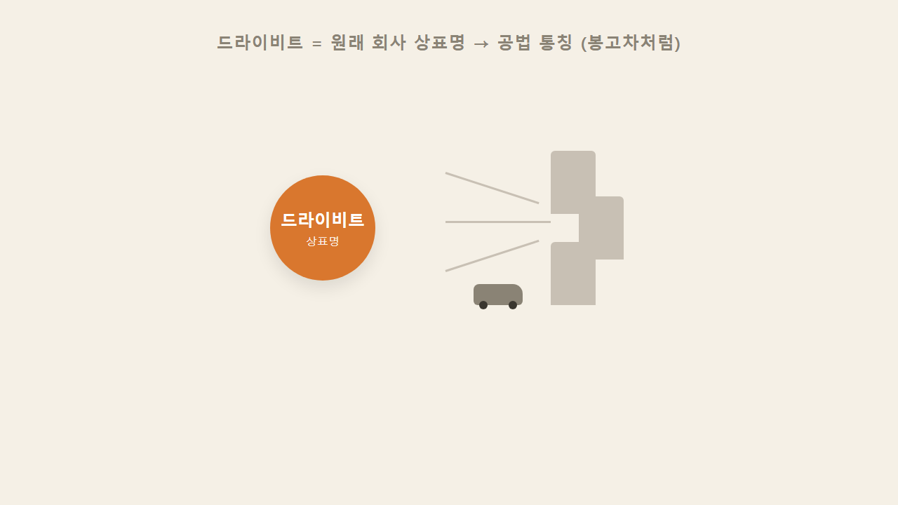
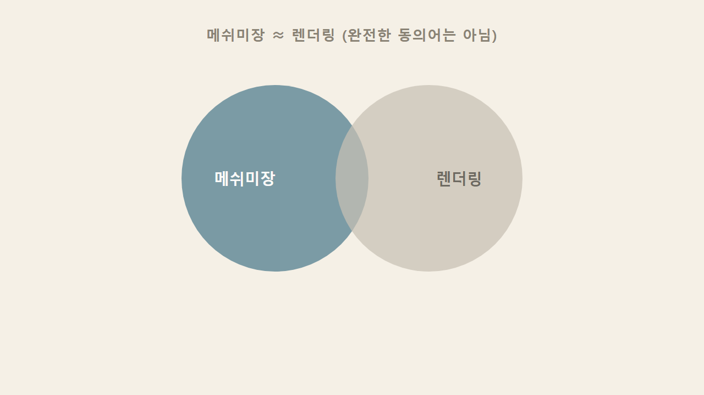
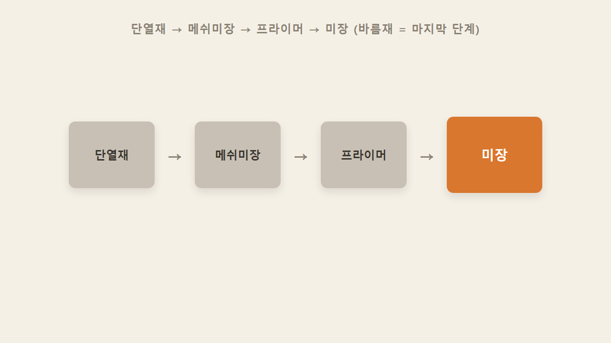
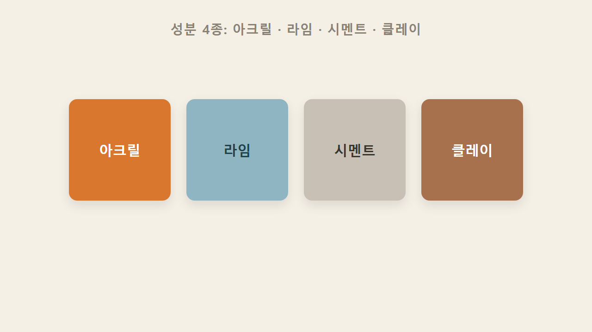
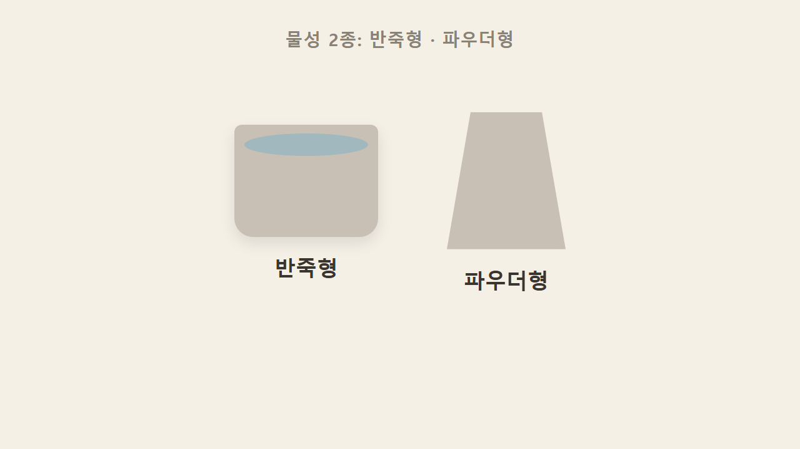
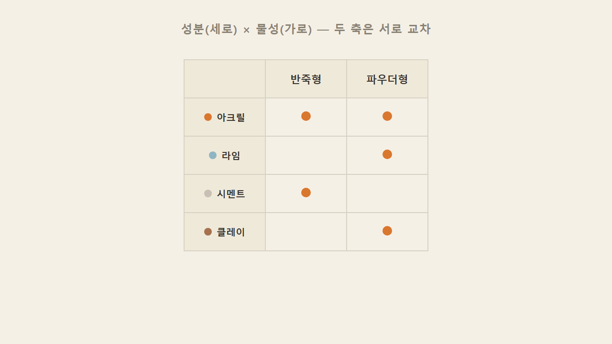
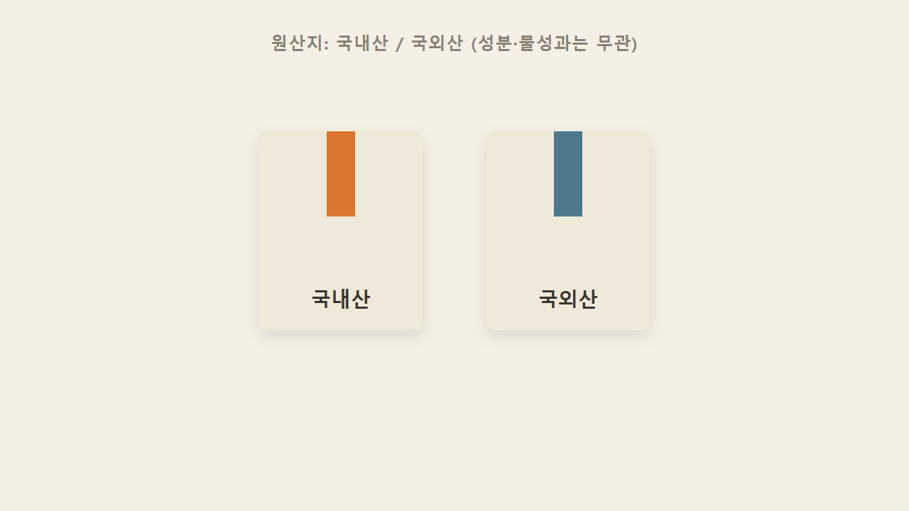

# EP6 — 용어와 분류

> 영상 EP6의 학습용 텍스트판. 화면·순서가 영상과 1:1. 원문 출처: [00_원문소스.md](00_원문소스.md)

## 1. 바름재 시리즈, 오늘부터 시작

지난 외단열 시리즈에서 단열재를 붙이고 메쉬미장까지 끝냈다. 이번 시리즈는 그 위에 실제로 발라 마감하는 재료, 바름재(플라스터)를 다룬다.

## 2. 스타코·스투코·플라스터 — 이름은 셋, 실체는 하나

스타코, 스투코, 플라스터는 전부 회반죽을 가리키는 말이다. 다만 시장에서 부르는 이름과 실제 제품 라벨에 적히는 표기는 서로 다르다 — 그 차이는 다음 섹션에서 이어진다.

## 3. 레진과 바인더는 다른 말이다

레진(수지)은 재료의 원료 성분, 즉 고분자 화학물질 그 자체를 가리킨다. 마감재 완제품이 아니라 마감재를 만드는 원료라는 뜻이다. 바인더는 성분이 아니라 기능이다 — 서로 다른 물질을 결합시키는 촉매 역할을 한다. 레진은 '무엇으로 만들었는가', 바인더는 '어떻게 붙였는가'로 구분하면 된다. 자주 섞어 쓰지만 엄연히 다른 말이다.

## 4. 시장 통칭 '스타코' vs 제품 라벨 'acrylic finish'

외국 제품 라벨을 보면 '스타코' 대신 보통 '아크릴 피니시(acrylic finish)'라고 적혀 있다. 스타코라는 단어 자체가 없다기보다, 시장에서 부르는 이름과 라벨에 찍힌 이름이 따로 노는 것이다.

## 5. 드라이비트 = 상표명이 공법 통칭으로 굳은 사례

드라이비트(Dryvit)는 원래 이 외단열 공법을 만든 회사의 상표명이다. 그 회사가 워낙 유명해지면서 공법 전체를 그냥 드라이비트라 부르게 됐다 — 승합차를 다 '봉고차'라고 부르는 것처럼, 상표가 일반명사로 굳어진 경우다.

## 6. 메쉬미장 ≈ 렌더링, 완전 동의어는 아니다

메쉬미장은 외국에서 렌더링(rendering)이라 부른다. 다만 대응되는 개념이지 완전히 똑같은 말은 아니다. 렌더링은 시멘트나 석회로 하는 초벌 미장까지 더 넓게 가리키는 말이기 때문이다.

## 7. 외단열 시공 4단계 — 바름재는 마지막 '미장'

단열재 부착 → 메쉬미장 → 프라이머 → 미장. 이번 시리즈에서 배우는 바름재는 이 네 단계 중 마지막 '미장' 자리에 들어간다.

## 8. 성분 축 — 아크릴·라임·시멘트·클레이

바름재를 나누는 첫 번째 축은 성분이다. 아크릴, 라임(석회), 시멘트, 클레이 — 이 네 성분 중 하나를 기반으로 만들어진다. 이 네 성분은 다음 편들에서 하나씩 완전정복한다.

## 9. 물성 축 — 반죽형·파우더형

두 번째 축은 물성(형태)이다. 성분과는 별개로, 반죽형(이미 반죽된 상태로 통에 담겨 나옴)과 파우더형(가루 상태로 나와 현장에서 물 등을 섞어 씀) 두 가지로 나뉜다.

## 10. 성분 × 물성 — 두 축은 서로 교차한다

성분 축과 물성 축은 완전히 별개의 기준이라 서로 교차한다. 성분이 아크릴이면서 물성이 반죽형일 수도 있고, 라임이면서 파우더형일 수도 있다.

## 11. 원산지 구분 — 국내산·국외산

마지막으로 제품 종류는 국내산과 국외산으로도 나뉜다. 이는 성분·물성과는 무관한, 단순한 원산지 구분이다.

### 한 줄 정리

> 스타코·스투코·플라스터는 다 회반죽이고, 바름재는 성분(아크릴·라임·시멘트·클레이)과 물성(반죽형·파우더형) 두 축으로 나뉜다.

### 셀프 체크

**Q1.** 레진과 바인더 중, '결합 기능'을 하는 건?
**A.** 바인더. 레진은 원료 성분, 바인더는 결합 기능이다.

**Q2.** 바름재를 성분으로 나누면 몇 가지?
**A.** 네 가지 — 아크릴, 라임, 시멘트, 클레이.

**Q3.** 외단열 시공 순서에서 메쉬미장 다음 단계는?
**A.** 프라이머. 그다음이 바로 오늘 배운 미장(바름재) 차례다.
