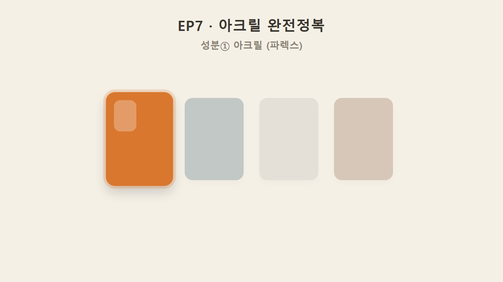
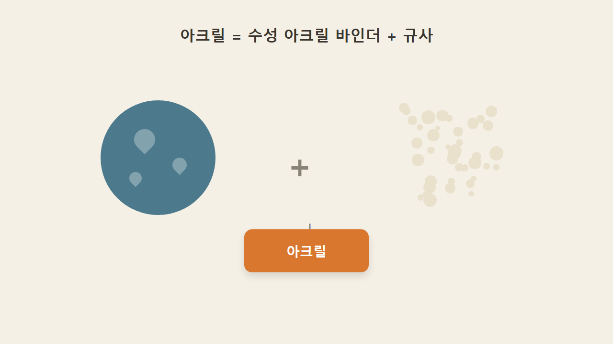
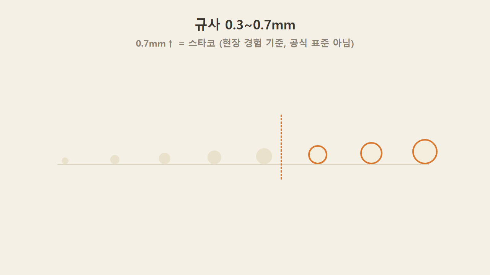
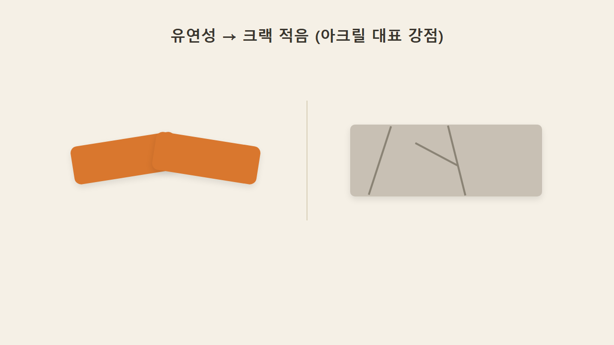
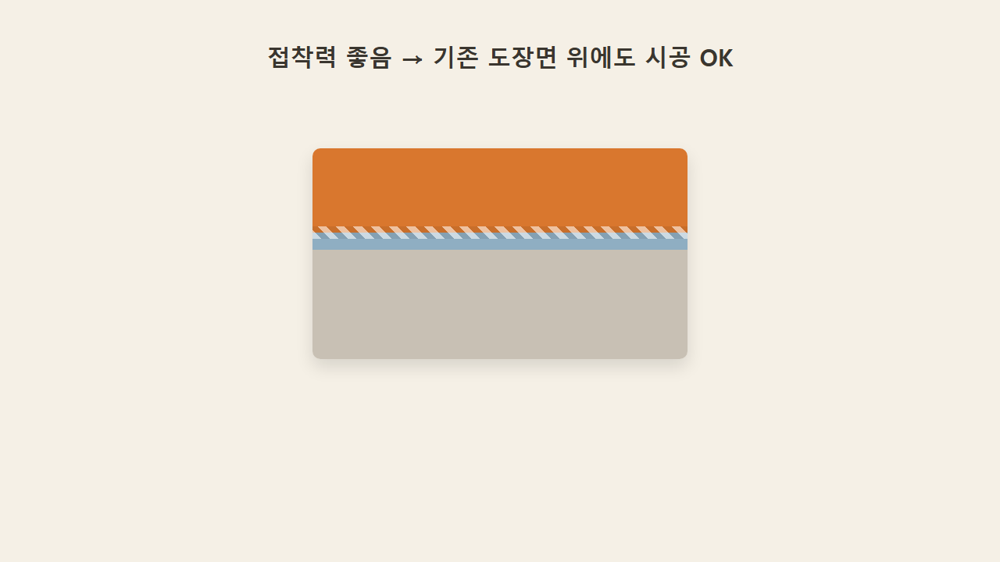
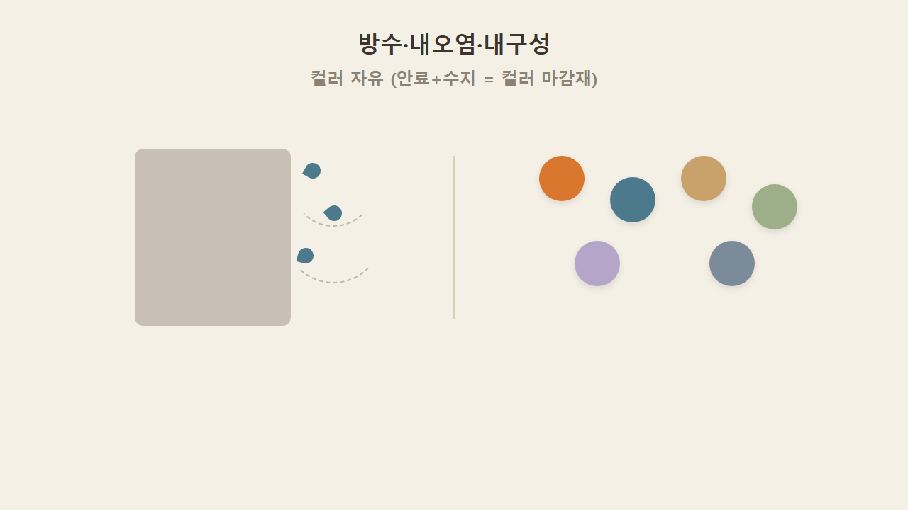
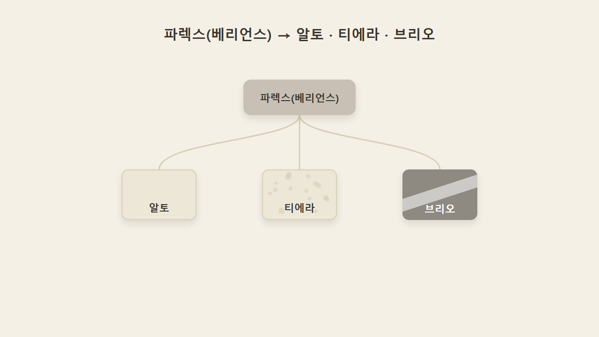
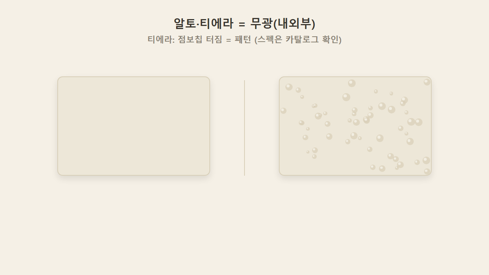
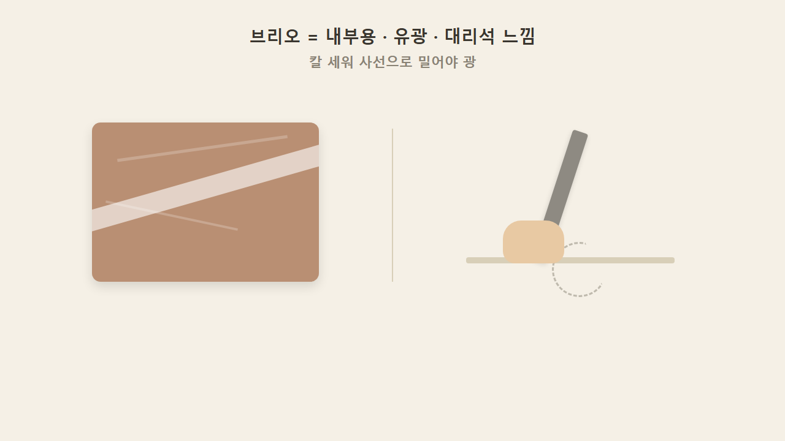
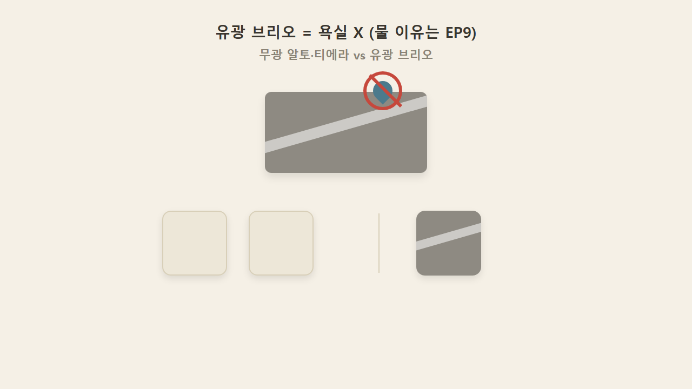

# EP7 — 아크릴 완전정복

> 영상 EP7의 학습용 텍스트판. 화면·순서가 영상과 1:1. 원문 출처: [00_원문소스.md](00_원문소스.md)

## 1. 성분①, 아크릴 완전정복

지난 편에서 정리한 성분 네 가지 중 첫 번째, 아크릴을 오늘 끝까지 파본다. 아크릴은 왜 유일하게 기존 페인트가 칠해진 벽 위에도 그냥 발라도 될까 — 답은 접착력과 유연성이다.

## 2. 아크릴 구성 — 수성 아크릴 바인더 + 규사

아크릴 바름재는 수성 아크릴 바인더에 규사를 섞은 것이다.

## 3. 규사 입자 크기 — 0.3~0.7mm, 0.7mm 이상은 '스타코' (현장 기준)

규사 입자 크기는 0.3mm에서 0.7mm 사이다. 0.7mm 이상 굵은 입자를 업계에서 보통 '스타코'라고 부르는데, 이는 공식으로 딱 떨어지는 표준이 아니라 현장 경험에 따른 구분이다.

## 4. 골재 두 계열 — 규사(실리카) vs 탄산칼슘, 둘 다 철분 없음

샌드(골재)는 규사(실리카) 계열과 탄산칼슘(대리석분) 계열 두 가지로 나뉜다. 둘 다 철분이 없어 녹 걱정은 없다 — 녹은 철분이 든 일반 모래의 문제지 이 골재의 문제가 아니다. '아크릴샌드'라는 이름이 따로 있는 것처럼 들릴 수 있지만, 이는 별도의 광물이 아니라 구어적 표현으로 보인다. 탄성이나 크랙 저항은 골재가 아니라 아크릴 바인더가 담당하는 부분이다.

## 5. 강점① 유연성 → 크랙이 적다

아크릴계는 유연성·탄력이 있어 크랙이 비교적 적다. 이는 아크릴계의 대표적인 강점으로 꼽힌다.

## 6. 강점② 접착력 → 기존 도장면 위에도 시공 가능

접착력이 좋아서 이미 페인트가 발라진 벽 위에도 그대로 작업에 들어갈 수 있다. 유연성과 접착력, 이 두 특성이 합쳐져 나온 결과다.

## 7. 강점③ 방수·내오염·내구성 + 컬러 자유

방수성과 내오염성이 좋고, 내구성·내수성도 좋아 기후 변화에도 잘 버틴다. 컬러도 자유로운 편인데, 안료(농축된 색상)에 아크릴 수지를 섞으면 그대로 컬러 마감재가 되어 색이 균일하고 연출이 편하다.

## 8. 파렉스(베리언스) 브랜드 트리 — 알토·티에라·브리오

미국 아크릴 회사 파렉스, 그중 베리언스 라인 아래 알토·티에라·브리오 세 제품이 있다.

## 9. 알토·티에라 — 무광, 티에라는 점보칩 (카탈로그 확인 필요)

알토는 내·외부 모두 가능하고 무광이다. 티에라도 내·외부 가능·무광인데, 점보칩이 들어 있어 바르는 도중 칩이 터지면서 표면이 울퉁불퉁해진다. 이 울퉁불퉁함은 실수가 아니라 그대로 패턴이 되는 것으로, 한쪽으로 몰리지 않도록 동서남북으로 골고루 펴줘야 한다. 다만 이 제품 스펙은 라인업마다 달라질 수 있어 카탈로그 기준 확인이 필요한 부분이다.

## 10. 브리오 — 내부용·유광·대리석 느낌, 칼 세워 사선으로

브리오는 완전히 다르다. 내부용이고 광이 나며, 대리석 느낌 연출까지 가능하다. 쫀득한 느낌이 나는데, 바르고 나서 반대로 미는 동작은 하면 안 된다. 광을 내려면 사선으로, 경사를 심하게 줘서 칼을 세워 밀어야 한다.

## 11. 브리오는 욕실 X — 무광 둘 vs 유광 하나

광나는 브리오는 욕실에는 쓸 수 없다(이유는 EP9에서 물 얘기와 함께 다룬다). 알토·티에라는 주방 싱크대·화장실에도 쓸 수 있는데, 바닥엔 방수, 벽체는 발수성이 되도록 처리해야 한다. 결국 파렉스 삼형제는 무광 둘(알토·티에라), 유광 하나(브리오)로 갈린다.

### 한 줄 정리

> 아크릴은 유연·접착·방수·컬러가 다 좋은 만능형이고, 파렉스는 무광 알토·티에라와 유광 브리오로 나뉜다.

### 셀프 체크

**Q1.** 아크릴이 기존 도장면 위에도 발리는 이유 두 가지는?
**A.** 접착력과 유연성.

**Q2.** 파렉스 제품 중 유광인 것은?
**A.** 브리오.

**Q3.** 규사 0.7mm 이상은 보통 뭐라고 부르나(현장 기준)?
**A.** 스타코.
