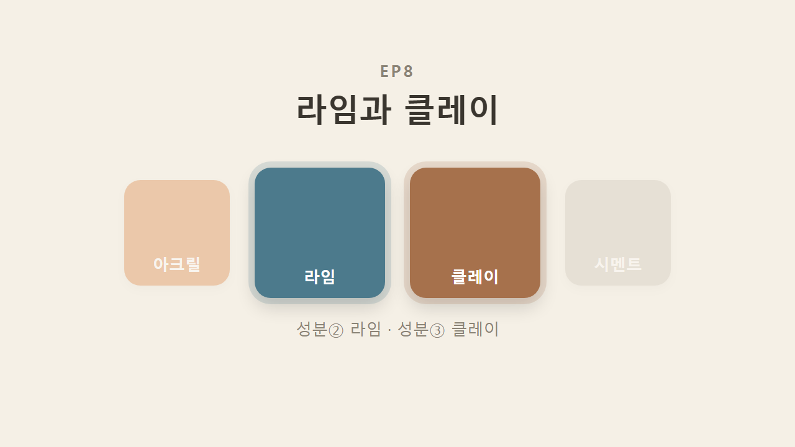
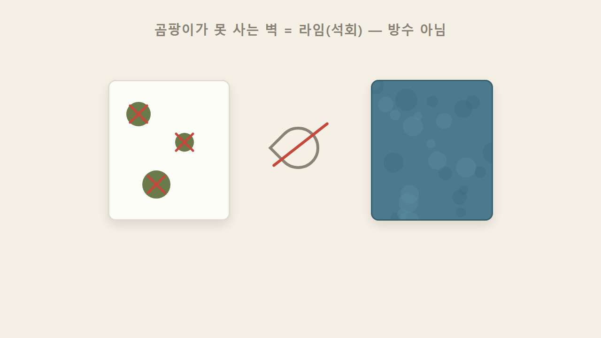
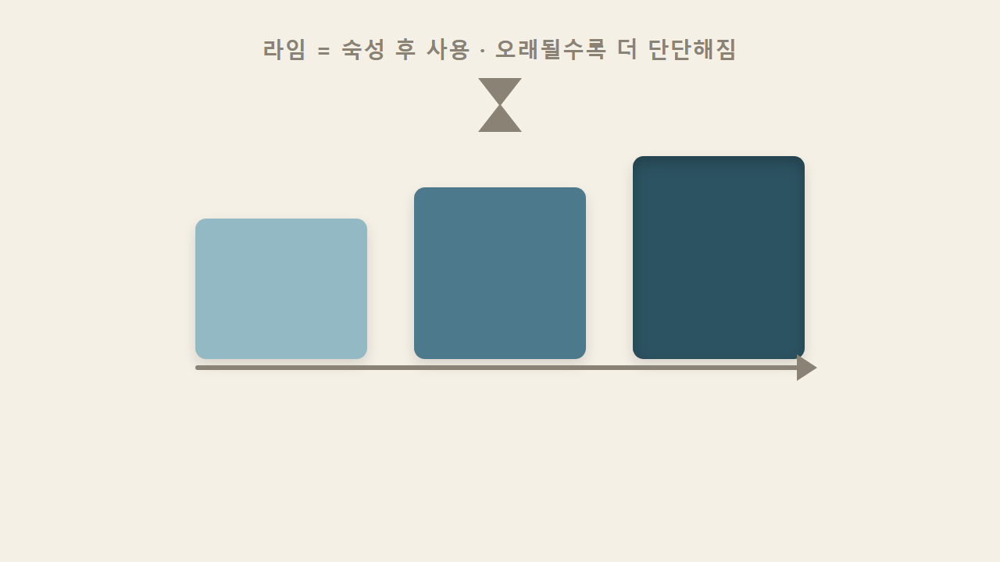
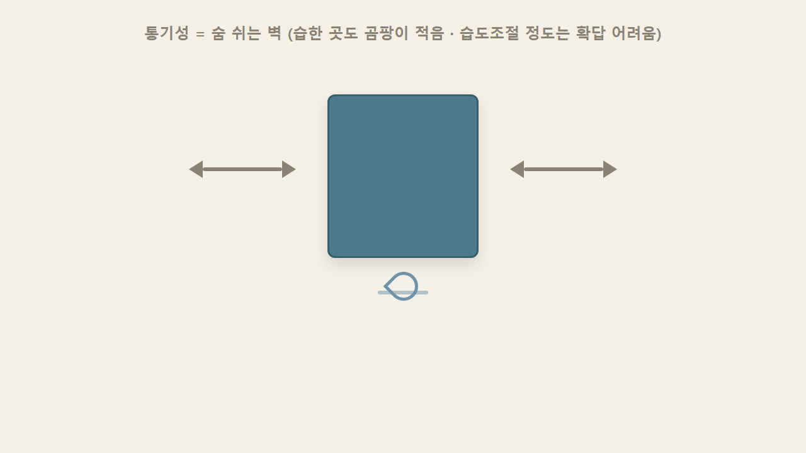
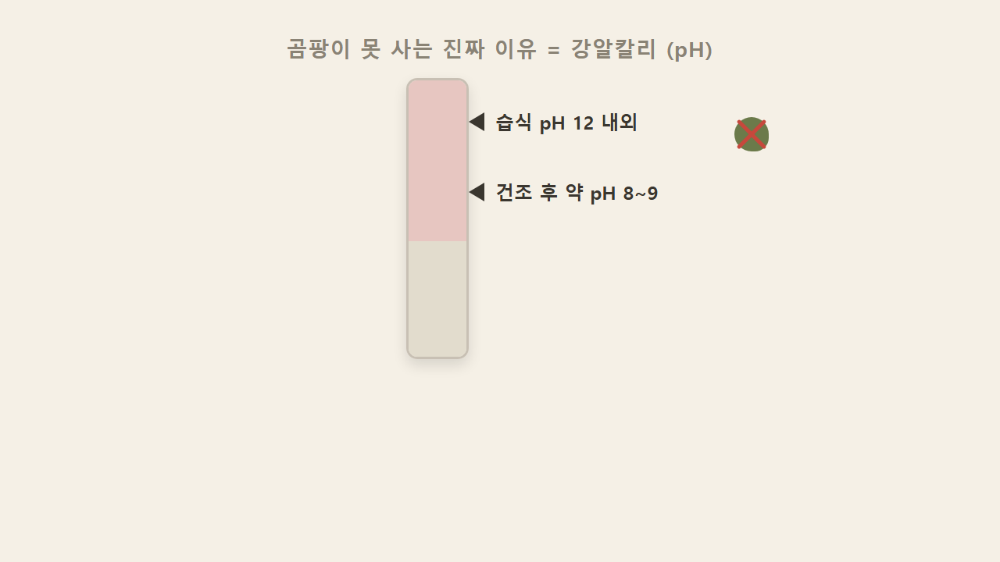
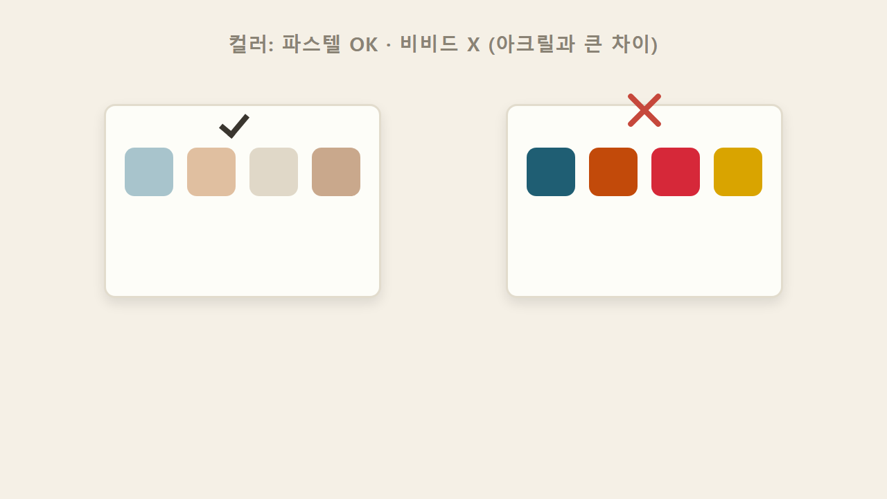
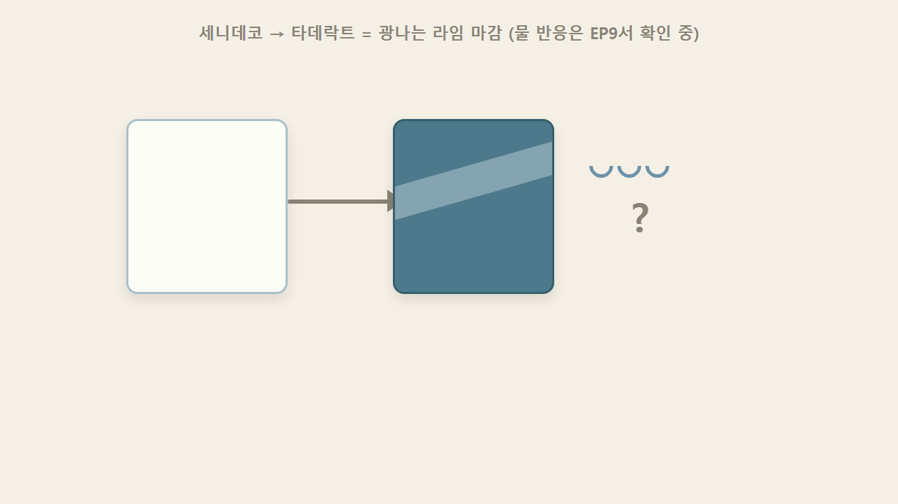
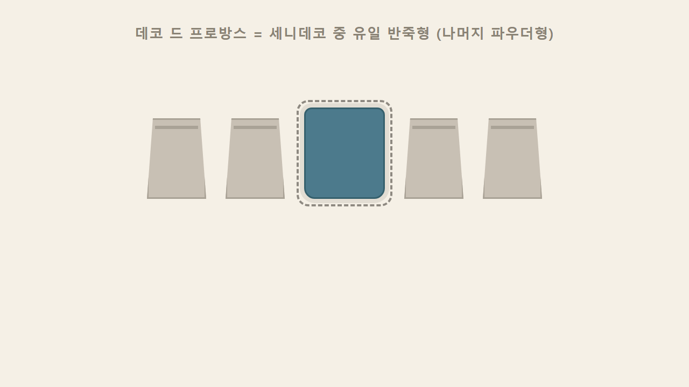
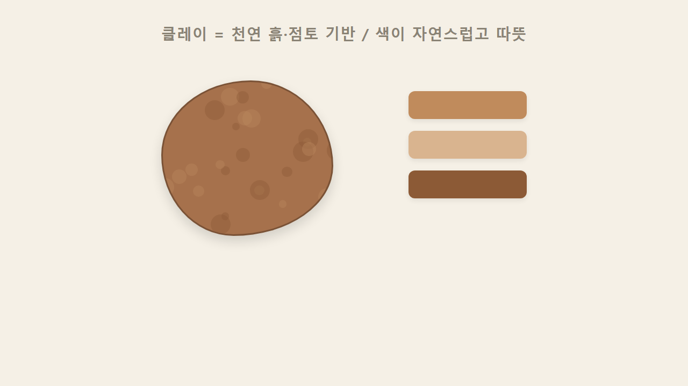
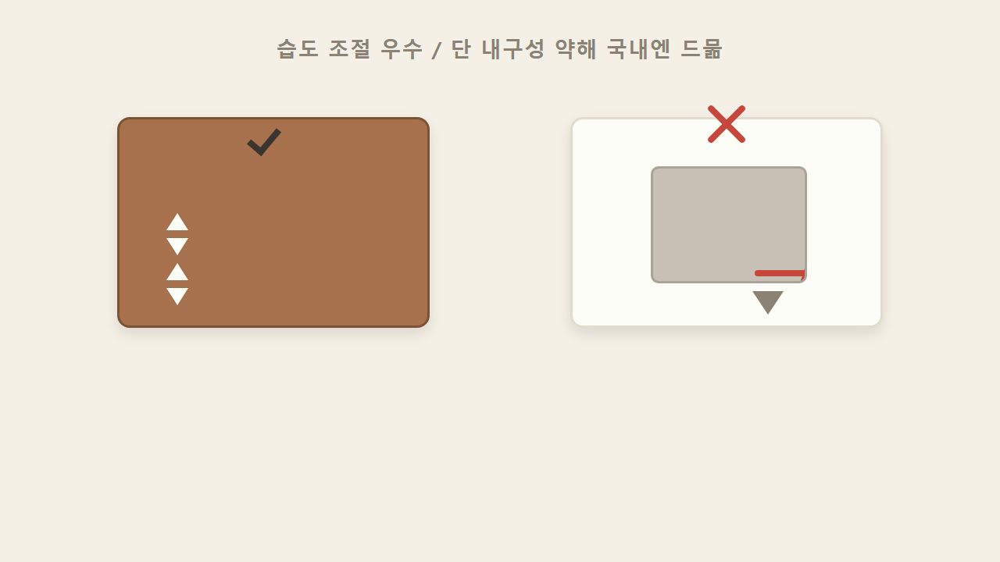

# EP8 — 라임과 클레이

> 영상 EP8의 학습용 텍스트판. 화면·순서가 영상과 1:1. 원문 출처: [00_원문소스.md](00_원문소스.md)

## 1. 성분②③, 라임과 클레이

지난 편에서 아크릴을 완전정복했다. 오늘은 나머지 자연·친환경 계열 두 성분, 라임과 클레이를 다룬다.

## 2. 곰팡이가 못 사는 벽 = 라임(석회), 방수 때문이 아니다

곰팡이가 절대 못 사는 벽이 있다면 그건 방수 때문이 아니라 성분 자체가 균을 못 살게 하는 것이다. 그 성분이 라임, 즉 석회다.

## 3. 숙성시켜 사용, 오래될수록 더 단단해진다

라임은 그냥 쓰는 게 아니라 숙성시켜 쓴다. 특이한 점은 오래될수록 더 단단해진다는 것 — 굳고 끝나는 게 아니라 계속 굳어가는 특성이다.

## 4. 통기성 — '숨 쉬는 벽'

라임 벽은 '숨을 쉰다'고 표현할 만큼 통기성이 있다. 습한 발코니 같은 곳에 발라도 곰팡이가 잘 생기지 않고, 대신 물은 흐를 수 있다. 다만 습도를 얼마나 조절해주는지까지는 확답하기 어려운 부분이다.

## 5. 곰팡이 못 사는 진짜 이유 = 강알칼리성

곰팡이가 라임 벽에서 못 사는 진짜 이유는 통기성이 아니라 강알칼리성이다. 물과 섞여 있는 습식 상태에서는 pH 12 내외로 강알칼리인데, 마르면서 조금 낮아져 건조 후에는 약 8~9 정도가 된다. 이 알칼리 환경에서는 곰팡이나 균이 자리를 잡지 못한다.

## 6. 만질수록 광이 난다

라임은 만지면 만질수록 광이 난다. 문지르는 손길 자체가 마감이 되는 셈이다.

## 7. 컬러는 파스텔까지 — 비비드는 힘들다

라임은 파스텔톤 연출은 잘 되지만, 쨍한 비비드 컬러 표현은 힘들다. 컬러가 자유로운 아크릴과 대비되는 지점이다.

## 8. 세니데코 → 타데락트, 광나는 라임 마감 (물 반응은 확인 중)

라임 계열에는 프랑스 세니데코라는 브랜드가 있고, 그 안에 타데락트라는 제품이 광나는 라임 마감으로 알려져 있다. 다만 타데락트가 물에 어떻게 반응하는지는 아직 확인 중인 부분이라 다음 편(EP9)에서 브리오와 함께 더 짚어본다.

## 9. 데코 드 프로방스 = 세니데코 중 유일한 반죽형

세니데코 라인에는 데코 드 프로방스라는 제품도 있다. 반죽 타입인데, 세니데코 라인 중에서 유일한 반죽형으로 알려져 있다. 나머지는 파우더형이다.

## 10. 클레이 = 천연 흙·점토 기반, 자연스럽고 따뜻한 색감

클레이는 천연 흙, 점토를 기반으로 한 성분이다. 인위적으로 낸 색이 아니라 흙 그 자체의 색이기 때문에 색감이 매우 자연스럽고 따뜻하다.

## 11. 습도 조절은 우수, 다만 내구성이 약해 국내엔 드물다

클레이는 습도 조절 성능이 뛰어나다 — 라임의 애매한 습도 조절과 달리 이 부분은 확실히 좋다. 다만 내구성이 떨어져서, 미국·유럽에는 제조사가 있어도 국내에서는 많이 쓰이지 않는다.

### 한 줄 정리

> 라임은 숨 쉬고 항균되는 강알칼리 벽(광택도 가능하지만 컬러는 파스텔까지), 클레이는 흙 그대로의 습도조절 벽(단 내구성이 약해 국내엔 드물다).

### 셀프 체크

**Q1.** 곰팡이가 라임 벽에 못 사는 진짜 이유는?
**A.** 강알칼리성. 통기성 때문이 아니다.

**Q2.** 반죽형으로 알려진 제품은?
**A.** 데코 드 프로방스.

**Q3.** 습도 조절이 특히 뛰어난 성분은?
**A.** 클레이.
