# EP9 — 시멘트와 공통 축

> 영상 EP9의 학습용 텍스트판. 화면·순서가 영상과 1:1. 원문 출처: [00_원문소스.md](00_원문소스.md)

## 1. 성분④ 시멘트, 그리고 물 기준으로 정리하는 시간
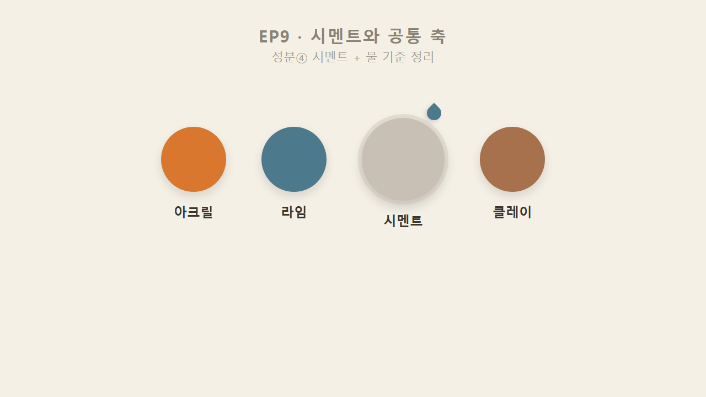

아크릴, 라임, 클레이까지 봤으니 오늘은 마지막 성분 시멘트다. 시멘트까지 배우고 나면 네 성분을 한 번에 꿰뚫는 질문 하나로 정리한다 — "물에 강해, 약해?"

## 2. 시멘트 = 제일 콘크리트스러운 질감
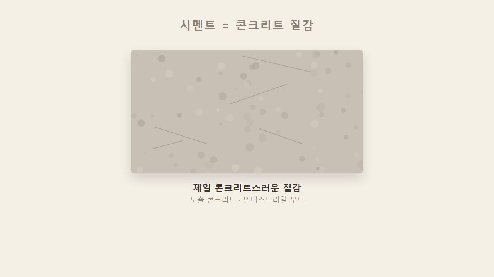

시멘트는 성분 중에 제일 콘크리트스러운 질감을 낸다. 카페 인테리어에서 흔히 보는 노출 콘크리트 느낌의 벽이 대개 시멘트 계열이고, 산업적인 느낌을 낼 때 가장 먼저 찾는 소재다.

## 3. 내구성 1위 = 시멘트
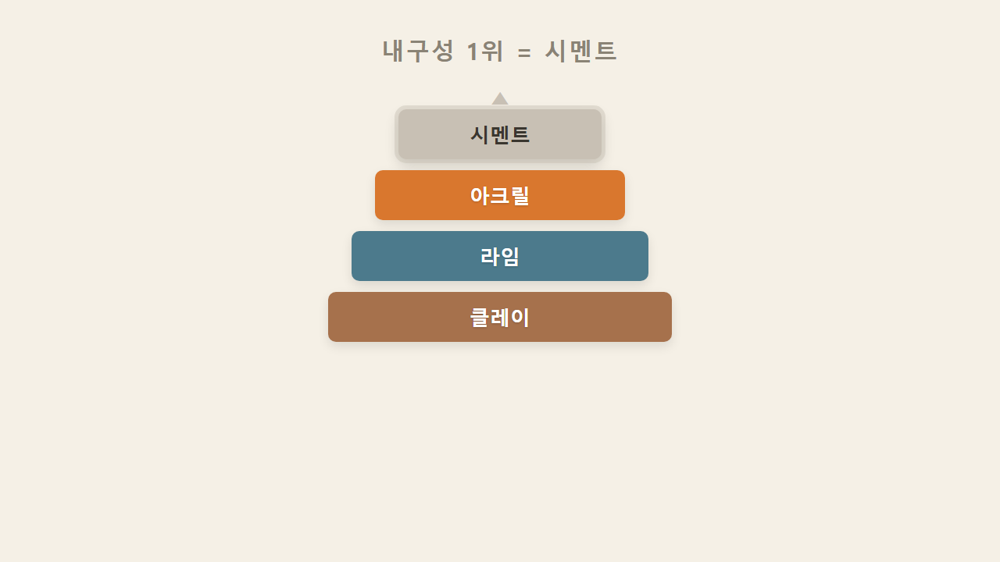

강도와 내구성은 좋은 편 정도가 아니라 성분 네 개 중 제일 좋다. 아크릴도 내구성이 좋은 편이지만, 그보다도 시멘트가 위에 있다.

## 4. 마이크로시멘트 = 얇게 여러 겹, 멀티레이어
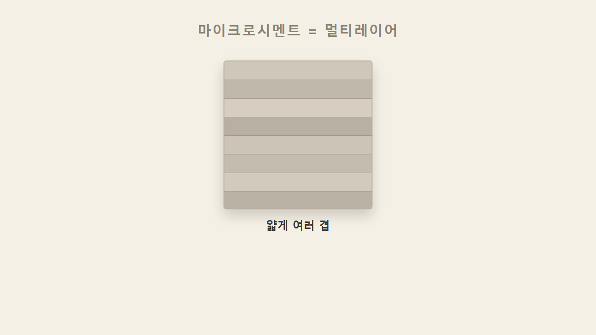

시멘트 안에는 마이크로시멘트라는 것이 있는데, 얇게 여러 겹 발라 층을 쌓는 멀티레이어 방식으로 많이 쓰인다.

## 5. 마이크로시멘트 ≠ UHPC — 관련은 있어도 같은 급은 아니다
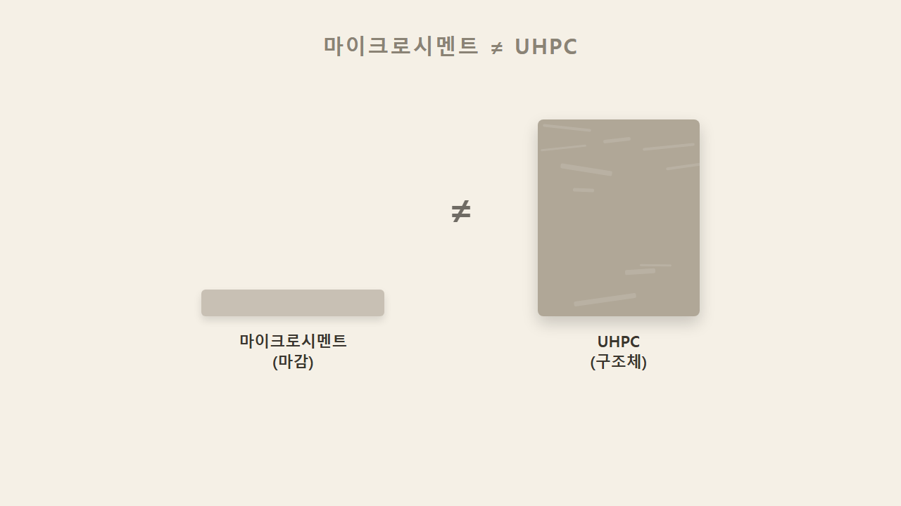

마이크로시멘트와 UHPC(초고강도 몰탈)는 이름이 비슷해 보이지만 같은 급이 아니다. UHPC는 구조체를 만드는 데 쓰는 완전히 다른 체급의 재료이고, 마이크로시멘트는 얇게 바르는 마감재다. 이름만 비슷할 뿐 묶어서 생각하면 안 된다.

## 6. 네 성분을 관통하는 질문 — "물에 강해, 약해?"
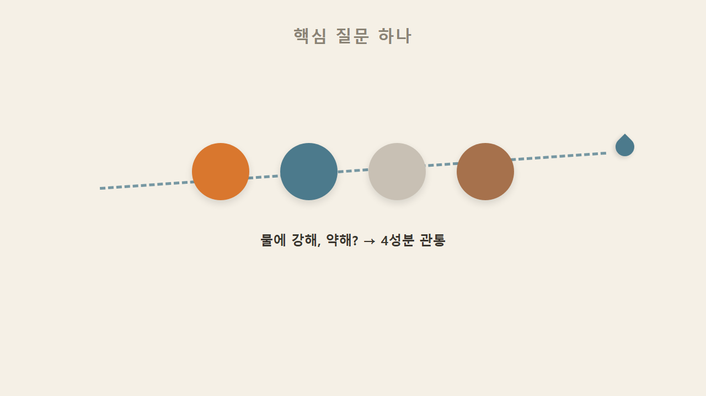

시멘트까지 네 가지 성분이 다 나왔으니, 이제 이 넷을 한 번에 꿰뚫는 질문으로 넘어간다. "물에 강해, 약해?" 이 질문 하나로 오늘까지 배운 소재들이 정리된다.

## 7. 광나는 마감(브리오·타데락트)은 물에 약하다
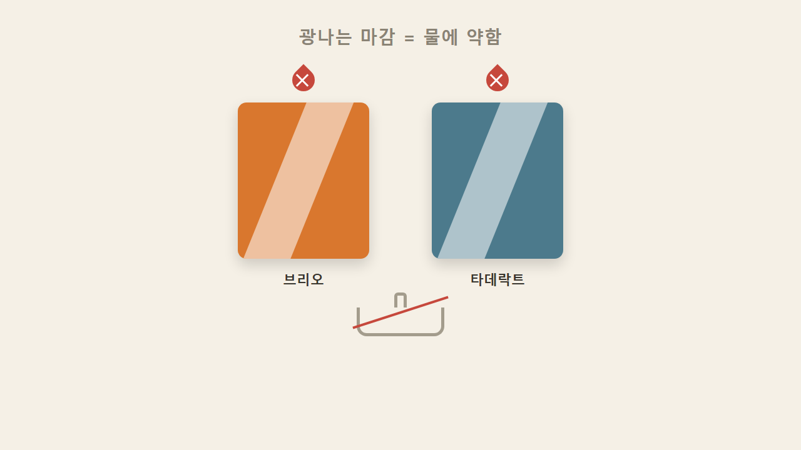

파렉스 브리오(아크릴·유광·대리석 느낌)와 라임 쪽 타데락트, 이 둘의 공통점은 광나게 마감한 제품은 물에 약하다는 것이다. 물자국이 남고, 계속 물에 닿으면 아예 녹아내릴 수 있어 욕실이나 싱크대에는 쓰지 못한다.

## 8. 타데락트 물성은 아직 확인 중 (단정 아님)
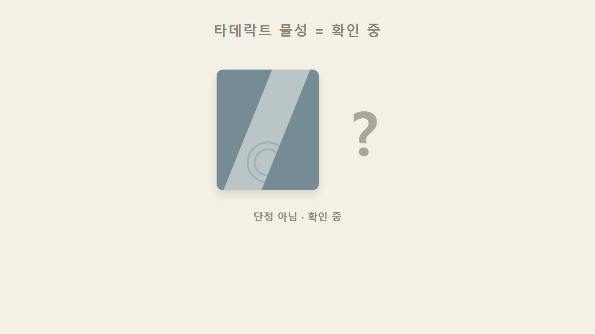

타데락트는 원래 물기 있는 곳에서 쓰는 방수 기법으로도 알려져 있어, "광나는 제품은 물에 약하다"와 다소 긴장 관계에 있다. 타데락트 자체의 특성인지 특정 제품·시공 조건에서만 그런 것인지는 아직 확실치 않은 부분이다. 현재로선 "광나게 마감된 제품은 물에 약할 수 있으니 욕실 같은 곳은 조심해야 한다" 정도로만 알아두는 게 정확하다.

## 9. 물 테스트로 현장에서 구분하기 (공식 시험법은 아님)
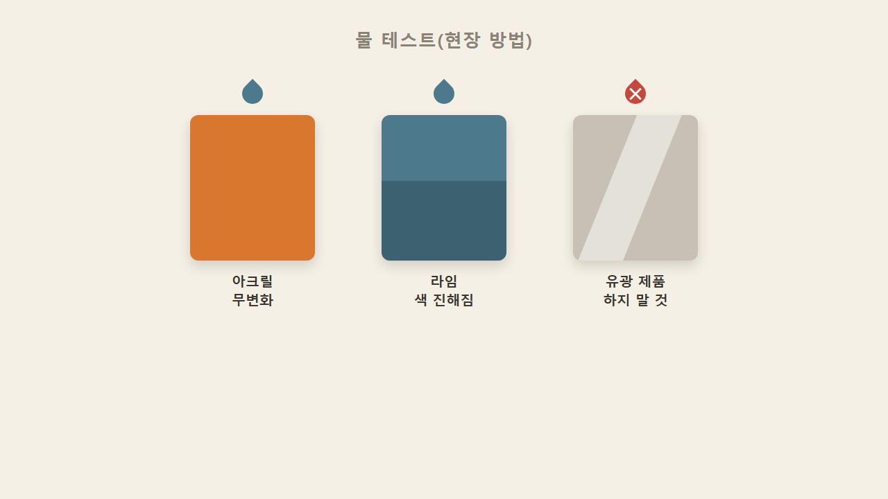

현장에서 아크릴과 라임을 헷갈릴 때 물을 살짝 묻혀 확인하는 방법이 있다. 아크릴은 물이 묻어도 크게 티가 나지 않고, 라임은 젖으면 색이 훅 진해진다. 이는 공식 시험법이라기보다 현장에서 관행적으로 쓰는 구분법이다. 다만 브리오나 타데락트처럼 광나는 제품은 물 자체를 피해야 하므로 이 테스트도 하면 안 된다.

## 10. 공통 규칙 — 얇게 여러 번 바른다
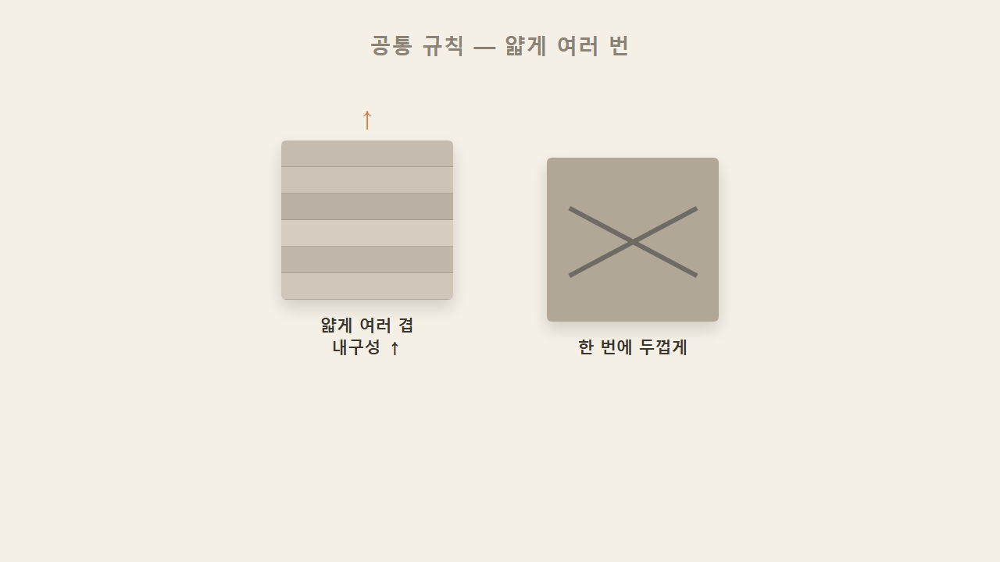

아크릴·라임·시멘트 같은 산업적인 제품들은 공통적으로 얇게 여러 번 바르는 규칙을 지킨다. 두껍게 한 번에 바르는 게 아니라 얇게 여러 겹 쌓아야 내구성이 올라간다. 마이크로시멘트가 멀티레이어로 층을 쌓는 것도 같은 원리다.

## 11. 내부용·외부용 = 물에 강하냐 약하냐로 갈린다
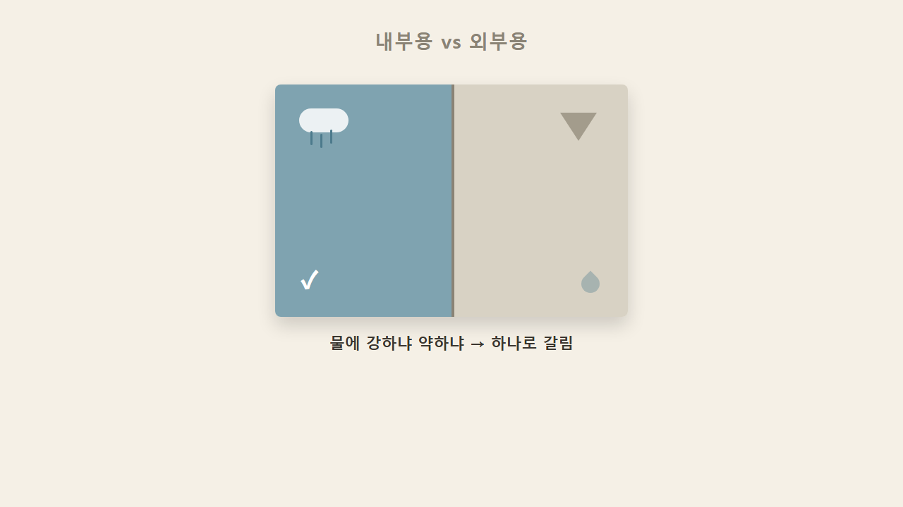

결국 처음 질문으로 돌아온다. 내부용과 외부용은 물에 강하냐 약하냐, 그 차이 하나로 갈린다. 물에 강하면 밖에서도 버티고, 약하면 안에서만 쓴다.

### 한 줄 정리

> 시멘트는 네 성분 중 내구성이 가장 강한 산업적 소재고(마이크로시멘트와 UHPC는 관련은 있어도 같은 급은 아님), 광나는 마감(브리오·타데락트)은 물에 약해 욕실엔 못 쓰며, 모든 소재는 얇게 여러 번 발라야 내구성이 오르고, 물에 강하냐 약하냐가 내부용·외부용을 가른다.

### 셀프 체크

**Q1.** 성분 네 개 중 내구성이 제일 강한 것은?
**A.** 시멘트.

**Q2.** 브리오나 타데락트를 욕실에 못 쓰는 이유는?
**A.** 광나는 마감이라 물에 약해서.

**Q3.** 내부용·외부용을 가르는 기준 한 가지는?
**A.** 물에 강하냐 약하냐.
